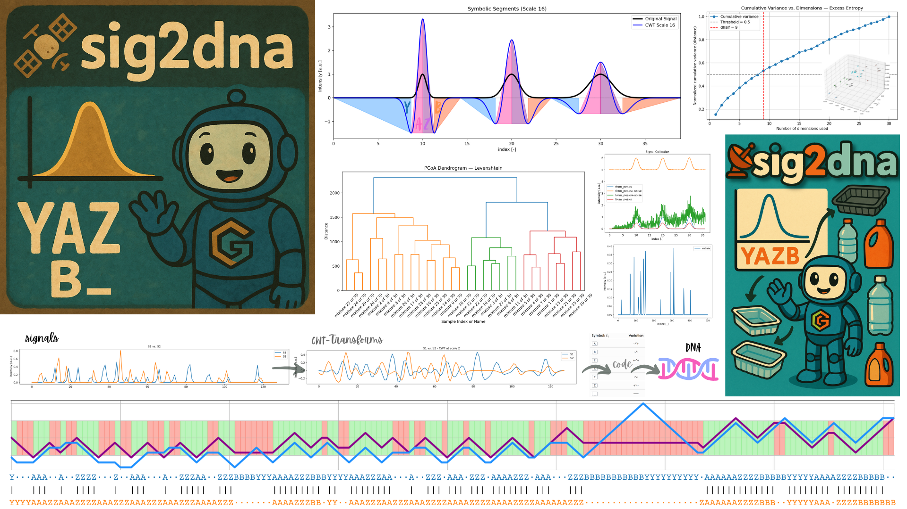

# 📡🧬 sig2dna

**Symbolic Signal Transformation for Fingerprinting, Alignment, and AI-Based Classification**

 ﹏ ﮩ٨ـﮩﮩ٨ـﮩ٨ـﮩﮩ٨ـ﹏﹏

>`sig2dna` is a Python module that transforms **complex 1D, 2D… analytical signals** into **DNA-like symbolic sequences** via morphological encoding. These symbolic fingerprints enable fast alignment, motif recognition, classification, and high-throughput comparison of signals originating from:
>
>- `GC-MS` / `GC-FID` - 🔍low and🔬high resolution
>- `HPLC-MS`  - 🔍low and🔬high resolution
>- `NMR` / `FTIR` / `Raman` / `RX`

It supports **large-scale applications** such as identifying unknown substances in ♻️ recycled materials or mixtures containing **NIAS** (*Non-Intentionally Added Substances*). 🗜️ Symbolic compression (up to 95%+) enables scalable storage and alignment—and seamless integration with **Large Language Models (LLMs)**.




<small>🎨 Credits: Olivier Vitrac</small>


> 📚 This approach was developed and tested as part of the PhD thesis:
>
> **Julien Kermorvant**, *"Concept of chemical fingerprints applied to the management of chemical risk of materials, recycled deposits and food packaging"*, AgroParisTech. 2023.
> https://theses.hal.science/tel-04194172


💡 **Note for ND-signals and multi-detector or multi-technique data**

`sig2dna` natively supports signal alignment and comparison across heterogeneous sources. This makes it particularly suited for **ND-signals** (*non-destructive signals*) or **aggregated data** from different detectors or acquisition techniques.

➡️ You can seamlessly concatenate or compare signals originating from **different instruments or modes** (e.g., UV + MS, GC×GC, LC-FTIR, etc.) — the symbolic coding abstracts away intensity scales and detector-specific artifacts, focusing instead on **morphological motifs**.

> Additional recommendations for 🖼️ 2D and 🗂️ multimodal acquisition systems are given at the end of this document 📄.

---


## 📚 Table of Contents

<!-- START doctoc generated TOC please keep comment here to allow auto update -->
<!-- DON'T EDIT THIS SECTION, INSTEAD RE-RUN doctoc TO UPDATE -->

- [🧩 1| **Main Components**](#-1-main-components)
- [🧠 2| **Applications**](#-2-applications)
- [🧬 3| **Core Concepts** - Overview](#-3-core-concepts---overview)
- [🧠 4| **Entropy and Distance Metrics**](#-4-entropy-and-distance-metrics)
- [🌀 5 | **Sinusoidal Encoding of Symbolic Segments**](#-5--sinusoidal-encoding-of-symbolic-segments)
- [🔍 6| **Baseline Filtering and Poisson Noise Rejection**](#-6-baseline-filtering-and-poisson-noise-rejection)
- [🧪 7| **Synthetic Signal Generation**](#-7-synthetic-signal-generation)
- [📦 8| **Available Classes**](#-8-available-classes)
- [📏  9| **Example Workflow**](#--9-example-workflow)
- [📊 10| **Visualization**](#-10-visualization)
- [🔎 11| **Motif Detection**](#-11-motif-detection)
- [🤝 12| **Alignment**](#-12-alignment)
- [🧪 13| **Examples** (unsorted)](#-13-examples-unsorted)
- [📦 14| **Installation**](#-14-installation)
- [💡15| **Recommendations**](#15-recommendations)
- [📄 | License](#--license)
- [📧 | Contact](#--contact)

<!-- END doctoc generated TOC please keep comment here to allow auto update -->

------


## 🧩 1| **Main Components**

| Class                 | Description                                                  |
| --------------------- | ------------------------------------------------------------ |
| `DNAsignal`           | Encodes numerical signal as symbolic sequence (multi-scale wavelet transform) |
| `DNAstr`              | A symbolic string with alignment, entropy, motif search, plotting, etc. |
| `DNApairwiseAnalysis` | Computes and visualizes distances, PCoA, clustering, scatter, dendrogram |

---


## 🧠 2| **Applications**

- High-throughput chemical pattern recognition 🆔, -ˋˏ✄┈┈┈┈
- NIAS tracking in complex matrices ⌬,🔔⚠️
- AI-compatible signal fingerprints 🫆🔎
- Classification of recycled material batches ♻️ 👍
- Detection of structural motif distortions (due to overlapping compounds) 🕵🏻
- AI-assisted quality control 
- AI-assisted compliance testing 🍽️

---


## 🧬 3| **Core Concepts** - Overview


> **Morphology Encoding as a “Genetic” Code**. Chemical signals are subjected to signal morphology encoding using continuous, symmetric wavelet transforms. The symbolic sequences are similar to genetic code. It is based on a limited number of letters,  symbols appear grouped into motifs which behave like  codons  As a result, a motif table can be used to recognize n-upplets in ^1^H-NMR, mass spectra, retention times, etc. 
>
> **Motif Recognition.** Searches of substances or typical patterns can be carried out via regular expressions or via transition probabilities (A→Z vs. Z→B vs. A→A) over a sliding window. All operations can be carried out in parallel for efficiency and automated treatment.
>
> **Scalable Machine-Learning**. High compression ratios enable the efficient storage of millions of chemical signatures. 


### 3.1 **Input Signa**l ➡️

- One-dimensional `signal` objects (NumPy-based)
- Supports synthetic and experimental sources

```python
S = signal.from_peaks(...)
```

🟥

### 3.2 **Wavelet Transform** 〰

A **Mexican hat (Ricker)** wavelet is used:

```{math}
\psi_s(t) = \left(1 - \frac{t^2}{s^2}\right)e^{-\frac{t^2}{2s^2}}
```

The Continuous Wavelet Transform (CWT) of a signal $x(t)$ is:

```{math}
W_s(t) = x(t)*\psi_s(t) = \int x(\tau) \cdot \psi_s(t - \tau) \, d\tau
```

where $s$ is the scale parameter (typically powers of two, e.g., $s = 2^n$) and $*$ the convolution operator.


🟪

### 3.3 **Relationship of $W\_s(t)$ with the second derivative** $x''(t)=\frac{\partial^2 x(t)}{\partial t^2}$

Applying the **Ricker wavelet (second derivative of a Gaussian**) to the signal $x(t)$ via convolution (i.e., CWT) is equivalent to computing the **second derivative of $x(t)$** smoothed by the Gaussian kernel $g\_s(t)$:

```{math}
W_s(t) = x(t)*\psi_s(t) = x(t) * g''(t) = x''(t) * g(t)
```

<details>
    <summary>Click here for the demonstration</summary>


The **convolution** of $x(t)$ with the second derivative of $g(t)$ is:

$(x * g'')(t) = \int\_{-\infty}^{\infty} x(\tau) g''(t - \tau) \, d\tau$

We perform a **change of variable**: let $u = t - \tau$, so $\tau = t - u$ and $d\tau = -du$. This gives:

$(x * g'')(t) = \int\_{-\infty}^{\infty} x(t - u) g''(u) \, du$

Now consider the convolution of the **second derivative of $x(t)$** with $g(t)$:

$(x'' * g)(t) = \int\_{-\infty}^{\infty} x''(\tau) g(t - \tau) \, d\tau$

Again, perform the **change of variable** $u = t - \tau$, yielding:

$(x'' * g)(t) = \int\_{-\infty}^{\infty} x''(t - u) g(u) \, du$


*Now integrate by parts twice*:

* **First integration by parts** (assuming $g(u) \to 0$ and $x'(t - u) \to 0$ as $u \to \pm \infty$):

$\int x''(t - u) g(u) \, du = - \int x'(t - u) g'(u) \, du$

* **Second integration by part**s:

$-\int x'(t - u) g'(u) \, du = \int x(t - u) g''(u) \, du$

Which yields:

$(x'' * g)(t) = \int x(t - u) g''(u) \, du = (x * g'')(t)$

</details>

🟦

### 3.4 **Symbolic Encoding** 🔡

Each segment of the wavelet-transformed signal is encoded into one of the symbolic codes corresponding to the table of variation $\text{sign}\left(\frac{\partial}{\partial t}W\_s(t)\right)$ and $\text{sign}\left(W\_s(t)\right)$.

| Symbol: $\ell\_i$ | Variation | Description                                     |
| ----------------- | :-------: | ----------------------------------------------- |
| <kbd>A</kbd>      |    -↗+    | Increasing crossing from − to + (zero-crossing) |
| <kbd>B</kbd>      |    -↗-    | Increasing negative                             |
| <kbd>C</kbd>      |    +↗+    | Increasing positive                             |
| <kbd>X</kbd>      |    +↘+    | Decreasing positive                             |
| <kbd>Y</kbd>      |   -↘\-    | Decreasing negative                             |
| <kbd>Z</kbd>      |    +↘-    | Decreasing crossing from + to − (zero-crossing) |
| <kbd>\_</kbd>     |    ──     | Flat or noise segment                           |

Each segment stores its `width`, `height`, and `position`. 

> The full-resolution symbolic sequence is reconstructed by interpolating or repeating these symbols proportionally to their span. A quantitative pseudo-inverse is proposed to reconstruct chemical signals from their code.

🟩

### 3.5 **Symbolic Compression** 🗜️

Symbolic sequences can be compressed and encoded at full resolution via:

```python
dna.encode_dna()
dna.encode_dna_full(resolution="index")
```

Resulting in DNA-like sequences like:

```text
"YYAAZZBB_YAZB"
```

🟨

### 3.6 **Structural Meaning** (e.g., <kbd>Y</kbd><kbd>A</kbd><kbd>Z</kbd><kbd>B</kbd> Motif)

A single Gaussian peak transformed via the Ricker wavelet results in:

- <kbd>Y</kbd>: rising pre-lobe ꒷꒦꒷꒦꒷꒦꒷꒦꒷꒦꒷
- <kbd>A</kbd>: left inflection (− to + crossing)
- <kbd>Z</kbd>: right inflection (+ to − crossing)
- <kbd>B</kbd>: trailing decay

The `YAZB` motif is a **symbolic map of the Ricker wavelet transform (CWT) of a Gaussian**.  An alteration of the pattern  reveals overlapping Gaussians ,  asymmetric signals or more generally interactions and interferences.

🟧

### 3.7 **Interpretation When Gaussians Overlap** 🌈⃤

When two Gaussians overlap, especially at close proximity or with different amplitudes:

1. The **central peak becomes asymmetric**.
2. The **Ricker transform** becomes a **superposition** of two wavelets.
3. This causes:
   - Emergence of **extra inflection points**,
   - Distortion of the clean <kbd>Y</kbd><kbd>A</kbd><kbd>Z</kbd><kbd>B</kbd>  sequence,
   - Insertion of intermediary motifs (e.g., repeating <kbd>A</kbd>-<kbd>Z</kbd> transitions, shortened or elongated lobes),
   - Possible merging of <kbd>Y</kbd><kbd>A</kbd><kbd>Z</kbd><kbd>B</kbd> motifs or partial truncation.

So **changes in the symbolic code structure** directly reflect **signal interference**, i.e., **nonlinearity in overlapping peaks**.

---


## 🧠 4| **Entropy and Distance Metrics**

> `Sig2dna` implements several metrics to evaluate the similarity of coded chemical signals. Alignment is essential to compare them while respecting order. It is performed via global/local pairwise alignment using `difflib` or `Biopython`. Excess Entropy and Jensen-Shannon are best choices in the presence of complex mixtures by enabling the detection of small structural changes.  

| Distance           | Sensitive to | Based on           | Alignment needed | Suitable for                          |
| ------------------ | ------------ | ------------------ | ---------------- | ------------------------------------- |
| **Excess Entropy** | Symbol order | Shannon entropy    | ✅ Yes            | Structural motif similarity           |
| **Jensen-Shannon** | Symbol usage | Probability dist.  | ❌ No             | Profile similarity (e.g., peak types) |
| **Levenshtein**    | Edit steps   | Insertion/Deletion | ✅ Yes            | Sequence-level variation              |
| **Jaccard**        | Pattern sets | Motif occurrences  | ❌ No             | Motif overlap, Motif density map      |


### 4.1 **Shannon Entropy** ⚀⚁⚂⚃⚄⚅

Entropy provides a **robust, physics-informed metric** for morphological comparisons.  For a symbolic sequence $X$, it reads:

```{math}
H(X) = -\sum_i p(\ell_i) \log_2 p(\ell_i)
```

where $p(\ell\_i)$ is the frequency of letter $l\_i$ in the sequence $X$.

Entropy $H$ is an extensive quantity verify additivity properties for independent sequences. Its value is accumulated between structured and low structured regions. Entropy is **invariant under translation and stable under small perturbations**, especially when using symbolic codes rather than raw intensities. This makes it ideal for comparing:

- Signals with **shifts in baseline**
- Morphologically similar but **intensity-scaled** signals
- **Partially distorted** sequences (e.g., from mixtures or degradation)

🔴

### 4.2 **Aligned sequences and Excess Entropy Distance**  ↔️

Let $A$ and $B$ be two symbolic sequences (`DNAstr`) representing two signals. After alignment (*e.g.,* via global/local pairwise alignment using `difflib` or `Biopython`), we obtain:

- $\tilde{A}$: aligned version of $A$ (with possible gap insertions)

- $\tilde{B}$: aligned version of $B$

- $\tilde{A} * \tilde{B}$: a new sequence formed by pairing corresponding symbols (possibly with gaps)

  

Given sequences $A$ and $B$, the mutually exclusive information or excess entropy is defined as:

```{math}
D_{\text{excess}}(A, B) = H(A) + H(B) - 2 H(\tilde{A} * \tilde{B})
```

where:

- $H(A)$ and $H(B)$ are the Shannon entropies of the original sequences
- $H(\tilde{A} * \tilde{B})$ is the Shannon entropy of the aligned signal pairs (treated as "joint letters")

🟠


### 4.3 **Jensen-Shannon Distance** ↔️

Let $P$ and $Q$ be the **empirical frequency distributions** of symbolic letters in two DNA-like coded signals $A$ and $B$, respectively. That is:

* $P = {p\_\ell}$ where $p\_\ell = \frac{\text{count of symbol } \ell \text{ in } A}{|A|}$
* $Q = {q\_\ell}$ where $q\_\ell = \frac{\text{count of symbol } \ell \text{ in } B}{|B|}$

Let $M$ be the average distribution:

```{math}
M = \frac{1}{2}(P + Q)
```

Then, the **Jensen–Shannon distance** between $P$ and $Q$ is defined as:

```{math}
D_{\text{JS}}(P, Q) = \sqrt{ \frac{1}{2} D_{\text{KL}}(P \| M) + \frac{1}{2} D_{\text{KL}}(Q \| M) }
```

where $D\_{\text{KL}}$ is the Kullback-Leibler divergence:

```{math}
D_{\text{KL}}(P \| M) = \sum_\ell p_\ell \log_2 \left( \frac{p_\ell}{m_\ell} \right)
```

and $m\_\ell$ is the frequency of symbol $\ell$ in the average distribution $M$.


#### 4.3.1 **Interpretation** 💡

* The **Jensen–Shannon distance** quantifies **how different the symbol usage is** between two signals, **ignoring the order** in which the symbols appear.
* It is **bounded between 0 and 1**, symmetric, and always finite (even when some symbols are missing in one sequence).
* A value of **0** indicates identical symbol distributions, while **1** indicates completely disjoint symbol usage.


#### 4.3.2 **Use Cases** 🧪

* **Robust against misalignment or noise**: two signals with similar overall composition but different positions will still score low JSD.
* **Useful for clustering** symbolic signals by type or composition, regardless of temporal structure.
* **Complementary to entropy or edit-based distances**, which capture positional or morphological changes.

🟡


### 4.4 **Jaccard Motif Distance** 🔍

The **Jaccard distance** measures the similarity between two symbolic signals by comparing the sets of **motifs** (short symbolic substrings) they contain, without requiring alignment. It is particularly suited for identifying common structural patterns across signals, regardless of their order or spacing.

Given two sequences $A$ and $B$, and a set of motifs $\mathcal{M}$ of length $k$ (typically 3–5 characters), we define:

* $\mathcal{M}(A)$: set of motifs found in $A$
* $\mathcal{M}(B)$: set of motifs found in $B$

Then the **Jaccard distance** is defined as:

```{math}
D_{\text{Jaccard}}(A, B) = 1 - \frac{|\mathcal{M}(A) \cap \mathcal{M}(B)|}{|\mathcal{M}(A) \cup \mathcal{M}(B)|}
```

#### 4.4.1 Key Features:

* ✅ **No alignment needed** — motif presence is evaluated globally
* 🔍 **Sensitive to local patterns** — detects repeated or shared symbolic structures
* 📈 **Sparse and interpretable** — suitable for heatmaps and clustering

#### 4.4.2 Implementation Notes:

* Motifs are extracted using a sliding window of fixed length (default: `k=4`)
* Symbol sequences are assumed to be from the encoded `DNAstr` outputs
* Motif sets are hashed to speed up large comparisons
* Jaccard scores are computed pairwise across a collection of symbolic sequences

This metric is especially useful when:

* You expect **common substructures** across signals
* Signals may differ in length or alignment is unreliable
* You want to create **density maps of motif usage** or explore **structural similarity clusters**


---

Here is the complete, cleanly formatted **README.md documentation section** for the new **sinusoidal encoder/decoder** functions added to `sig2dna`, including appropriate emojis and explanations:

------


## 🌀 5 | **Sinusoidal Encoding of Symbolic Segments**

`sig2dna` integrates a **transformer-style positional encoding** for symbolic segments, enabling conversion of **morphological features** into **fixed-size vectors**. This provides a compact, AI-ready representation of:

* ⏱️ Position ($x\_0$)
* 📏 Width ($\Delta x$)
* 📶 Amplitude ($\Delta y$)

> 💡 This mechanism replaces long repetitions of letters by a **numerically invertible vector encoding**, useful for clustering, attention-based models, or compressed storage.


###  5.1 Mathematical Basis 📐

Let $t \in \mathbb{R}$ be a scalar quantity (e.g., position, width, or height). The sinusoidal encoding $\mathbf{f}(t) \in \mathbb{R}^d$ is defined by:

```{math}
\begin{aligned}
f_{2k}(t) &= \sin\left(\frac{t}{r^k}\right), \\
f_{2k+1}(t) &= \cos\left(\frac{t}{r^k}\right),
\end{aligned}
\quad \text{for } k = 0, \dots, \frac{d}{2}-1
```

where:

* $r = N^{2/d}$ is a frequency base (default: $N = 10000$)
* $d$ is the number of embedding dimensions for the feature (default: $d = 32$)
* Each encoded feature (position, width, amplitude) gets its own $d$-vector

Then the full vector for one symbolic segment becomes:

```{math}
\mathbf{v} = [\mathbf{f}(x_0) \, \| \, \mathbf{f}(\Delta x) \, \| \, \mathbf{f}(\Delta y)]
\in \mathbb{R}^{3d}
```

These vectors are computed for each letter (A, B, ..., Z) and grouped accordingly.


> This encoding maps any scalar value $t$ (e.g., ⏱️, 📏, 📶) onto periodic functions. Due to the nature of sine and cosine, this representation is:
>
> * **translation-equivariant** for local displacements (relative order and spacing are preservd),
> * **periodic**, so absolute positions wrap with ambiguity (exact localization may be lossy).
>
> The **key mathematical identity** is:
>
> ```{math}
> f(t + \Delta t) = \mathrm{diag}(f(\Delta t)) \cdot f(t)
> 
> ```

```
>
>
> 👉 **shifting** a position $t$ by $\Delta t$ corresponds to a **linear transformation** of its embedding.
>
> ⚠️ To enable **invertibility**, we restrict $x_0$ within a known range $[0, L]$ with resolution determined by $N$ (current implementation), or add explicit absolute anchor


🔵〰️〰️⚪️〰️〰️〰️🔴


### 5.2  Decoding implementation 🗝️ 

- **Encoding**: $t \mapsto [\sin(t/r_k), \cos(t/r_k)]_{k=0}^{d/2 - 1}$

- **Decoding**:
- Convert $\sin$, $\cos$ pairs into $z_k = \cos + i\sin = e^{ix/r_k}$
  
- Unwrap $\angle(z_k)$ → gives $\theta_k \approx t/r_k$
  
- Fit $t$ via least-squares:


```{math}
x\_i = \frac{\sum\_k \theta\_{ik} \cdot \frac{1}{r\_k}}{\sum\_k \left(\frac{1}{r\_k}\right)^2}
```

- Robust, differentiable, and avoids scalar-local minima traps.

  

> Four decoders have been implemented 🔧:
>
> | Method            | Description                                    | Stability      |
> | ----------------- | ---------------------------------------------- | -------------- |
> | `'least_squares'` | Fast, phase-unwrapped projection               | ✅ Excellent    |
> | `'svd'`           | SVD-regularized LSQ for robust inversion       | ✅ Excellent    |
> | `'optimize'`      | Scalar optimization (slow, fragile)            | ❌ Unstable     |
> | `'naive'`         | Mean of phase-projected values (quick + dirty) | ❌ Wrong shifts |
>
> Rules of Thumb 🔧:
>
> | Option      | Action                       | Effect                           |
> | ----------- | ---------------------------- | -------------------------------- |
> | Use scaling | Normalize input to `[0, 10]` | Accurate decoding for wide range |
> | Reduce `N`  | Use e.g. `N = 1000`          | Higher range support             |


🔷〰️〰️🔷〰️〰️〰️🔷


### 5.3 `sinencode_dna()` – Letter-wise Sinusoidal Encoder 🔡 

Encodes all symbolic segments at selected scale(s) into sinusoidal vectors, grouped by letter (`A`, `Z`, `B`, etc.).

```python
dna.sinencode\_dna(scales=[4], d\_part=32)
```

🔧 Stored outputs:

- `self.code_embeddings_grouped`:

  ```python
  {
    4: {
      "A": np.ndarray (n\_A, 96),
      "Z": np.ndarray (n\_Z, 96),
      ...
    }
  }
  ```

- `self.code_embeddings_meta`:
  Metadata required for reconstruction:

  ```python
  {
    "sampling\_dt": 0.1,
    "x\_label": "RT",
    "x\_unit": "min",
    "y\_label": "Intensity",
    "y\_unit": "a.u.",
    "name": "GC-MS peak trace",
    "scales": [4],
    "d\_part": 32,
    "N": 10000
  }
  ```


🔶〰️〰️🔶〰️〰️〰️🔶


### 5.4 `sindecode_dna(...)` – Static Decoder to DNAsignal 🔁 

Reconstructs a new `DNAsignal` instance from sinusoidal embeddings:

```python
reconstructed = DNAsignal.sindecode\_dna(
    grouped\_embeddings = dna.code\_embeddings\_grouped,
    meta\_info = dna.code\_embeddings\_meta
)
```

🧬 Returns a complete `DNAsignal` object with:

- reconstructed `codes[scale]` dictionaries:
  - `letters`, `widths`, `heights`, `iloc`, `xloc`, `dx`
- empty signal (since waveform cannot be recovered from symbol encoding alone)

🧠 Ideal for:

- Embedding symbolic sequences for AI/ML workflows
- Comparing motifs without repeating long letters
- Visualizing symbolic structure in latent spaces


⭐〰️〰️⭐〰️〰️〰️⭐


### 5.5 Summary and error estimation  $\varepsilon = |\hat{t} - t|$  💬 

Each scalar $t$ (like $x_0$ or $\Delta x$) is **encoded** as:

```{math}
\mathbf{f}(t) = \left[ \sin\left(\frac{t}{r^0}\right), \cos\left(\frac{t}{r^0}\right), \dots, \sin\left(\frac{t}{r^{d/2-1}}\right), \cos\left(\frac{t}{r^{d/2-1}}\right) \right]
```

with $r = N^{2/d}$, typically $N = 10000$, and $d \sim 32$.


In decoding, we estimate $t$ by averaging multiple phase inversions:

```{math}
\hat{t} \approx \frac{1}{d/2} \sum\_{k=0}^{d/2 - 1} r^k \cdot \theta\_k,
\quad \text{where } \theta\_k = \arctan\left( \frac{\sin(t/r^k)}{\cos(t/r^k)} \right)
```

Let $L$ be the **maximum span** of $t$ values to encode (e.g., total signal length), and $d$ the embedding size (e.g., 32). Then:

* For $k=0$ (highest freq), $\text{period}_0 \sim 2\pi$
* For $k = d/2 - 1$, $\text{period}_k \sim 2\pi N$

So the **resolution** behaves like:

```{math}
\varepsilon \sim \frac{L}{N}
```

where $N$ is the frequency base and $L$ is the range of $t$ values being encoded (*e.g.*, max segment length or signal length)


| Feature      | Value                                                        |
| ------------ | ------------------------------------------------------------ |
| Error scales | $\varepsilon \sim L / N$                                     |
| Depends on   | Signal span $L$, base $N$                                    |
| Tunable by   | Increasing $d$ or $N$                                        |
| Accuracy     | Typically $<0.1%$ %of signal range ($L=500$ and $N=10^4$ gives $\varepsilon \approx \frac{500}{10000} = 0.05$ ) |
| Robustness   | Stable across most morphologies                              |

The errors are acceptable for:

* Motif alignment
* Classifiers
* Density maps
* Latent embeddings

----


## 🔍 6| **Baseline Filtering and Poisson Noise Rejection**

> The **Ricker wavelet** $\psi_s(t)$ used in `sig2dna` is mathematically the **second derivative of a Gaussian kernel**. As such, applying the Continuous Wavelet Transform (CWT) with $\psi_s(t)$ is equivalent to performing a **second-order differentiation** of the signal $x(t)$ followed by a **Gaussian smoothing**, where the scale parameter $s$ controls the bandwidth.
>
> This structure makes the CWT intrinsically robust to **low-frequency noise**, **baseline drifts**, and **stationary random noise** (such as column bleeding in GC). Moreover, the symmetry of $\psi_s(t)$ ensures suppression of **linear trends**, enhancing signal clarity without distorting peak structures.
>
> For ideal Gaussian-shaped peaks, the optimal CWT response is obtained when the scale $s$ matches the peak's width at its **inflection points**, which corresponds to **half-height** for a Gaussian. This is where the symbolic motif `YAZB` is most cleanly detected.
>
> However, on real-life signals, maximizing noise rejection by increasing $s$ can blur peak details. Preserving the **morphological fidelity** of peaks while ensuring their **detectability** requires operating **near the optimal scale**, not beyond it. To this end, `sig2dna` integrates a **robust preprocessing methodology** tailored for signals acquired through **accumulation or integration** (i.e., **counting statistics**), such as total ion counts in mass spectrometry or spectroscopic intensities.


### Step 1 — Median Baseline Subtraction ﹏𓊝﹏

Let $x(t)$ be the input signal. We compute a moving median over a window of width $w$:

```{math}
\text{baseline}(t) = \text{median}\left[x(t - w/2), \dots, x(t + w/2)\right]
```

Then, apply a non-negative correction:

```{math}
x\_b(t) = \max\left(0,\, x(t) - \text{baseline}(t)\right)
```

🏻‎🏼‎🏽‎🏾🏿

### Step 2 — Poisson Noise Estimation ▶︎ ၊၊||၊|။|||| |

From the baseline-corrected signal $x_b(t)$:

* Compute the local mean $\mu(t)$ and standard deviation $\sigma(t)$ using a uniform filter.
* Estimate the coefficient of variation:

```{math}
\text{cv}(t) = \frac{\sigma(t)}{\mu(t)}
```

Assuming Poisson noise, infer the local Poisson parameter:

```{math}
\lambda(t) = \frac{1}{\text{cv}(t)^2}
```

🏻‎🏼‎🏽‎🏾🏿

### Step 3 — Bienaymé–Tchebychev Thresholding 🗑️

To reject noise, use a threshold $T(t)$ derived from $\lambda(t)$:

```{math}
T(t) = k \cdot \sqrt{10 \lambda(t) \Delta t}
```

Filtered signal is then:

```{math}
x\_{bf}(t) = 
\begin{cases}
x\_b(t) & \text{if } x\_b(t) > T(t) \\
0 & \text{otherwise}
\end{cases}
```

---


## 🧪 7| **Synthetic Signal Generation**

Synthetic signals are modeled as a sum of Gaussian/Lorentzian/Triangle peaks. For Gaussian, they read

```{math}
s(t) = \sum\_{i} h\_i \cdot \exp\left(-\left(\frac{t - \mu\_i}{0.6006 \cdot w\_i}\right)^2\right)
```

where: 

* $h_i$: peak height
* $\mu_i$: center
* $w_i$: peak width (calibrated to Full **Width Half Maximum**)

This is used to:

* Reconstruct symbolic segments
* Generate artificial mixtures
* Simulate motifs for clustering or ML training
* Parses sequences into `YAZB` motif candidates (Mass spectra)

---


## 📦 8| **Available Classes**

**Module** `sig2dna_core.signomics.py`

| Class Name             | Description                                                  |
| ---------------------- | ------------------------------------------------------------ |
| `generator`            | Peak shape generator: Gaussian, Lorentzian, triangle         |
| `peaks`                | Peak library with synthesis, parameter control, and arithmetic operations |
| `signal`               | 1D signal class with plotting, peak summation, transformations, and noise |
| `signal_collection`    | Wrapper for multi-signal analysis: mean, sum, scaling, alignment, synthesis |
| `DNAstr`               | Symbolic sequence class with entropy, motif search, edit distances |
| `DNAsignal`            | Symbolic encoding/decoding from signals (DNA-like)           |
| `DNApairwiseAnalysis`  | Tools for clustering, dimensionality reduction, dendrograms, visual metrics |
| `DNAsignal_collection` | Wrapper for 2D, nD DNAsignals                                |
| `SinusoidalEncoder`    | Encoder/decoder for symbolic and numeric data using sinusoidal projections |
| `DNACodes`             | Dictionary-like symbolic representation of triplet codes (letter, width, height) |
| `DNAFullCodes`         | Dictionary-based encoder for resolution-based symbolic repetition |

**Class Inheritance Diagram**

```{mermaid}
graph TD;
DNACodes
DNAFullCodes
DNApairwiseAnalysis
DNAsignal
DNAsignal_collection
DNAstr
SinusoidalEncoder
generator
peaks
signal
signal_collection
UserDict --> DNACodes
dict --> DNAFullCodes
list --> DNAsignal_collection
list --> signal_collection
object --> DNApairwiseAnalysis
object --> DNAsignal
object --> SinusoidalEncoder
object --> generator
object --> peaks
object --> signal
str --> DNAstr
```

---


## 📏  9| **Example Workflow**

```python
from signomics import DNAsignal

# Load and encode
D = DNAsignal(S, encode=True)
D.encode\_dna()
D.encode\_dna\_full()

# Visualize
D.plot\_codes(scale=4)

# Entropy and distances
entropy = D.get\_entropy(scale=4)
analysis = DNAsignal.\_pairwiseEntropyDistance([D1, D2, D3], scale=4)
```

---


## 📊 10| **Visualization**

- `signal.plot()`, `signal_collection.plot()` : plot signals
- `DNAsignal.plot_signals()`: Original + CWT overlay
- `DNAsignal.plot_transforms()`: plot transformed signals a collection of signals
- `DNAsignal.plot_codes(scale=4)`: Colored triangle segments
- `DNAstr.plot_mask`:  plot alignment mask
- `DNAstr.plot_alignment`: plot aligned codes as reconstructed signals
- `DNApairwiseAnalysis.plot_dendrogram()`, `scatter3d(), scatter(), heatmap`, `dimension_variance_curve`:  Cluster and distance views

------


## 🔎 11| **Motif Detection**

Pattern search: ꒷꒦꒷꒦꒷꒦꒷꒦꒷꒦꒷

```python
listPat=D.codes[4].find("YAZB")
listPat[0].to\_signal().plot() # show the first match as a signal
```

Extract and plot motifs: ▌│█║▌║▌║

```python
D.codesfull[4].extract\_motifs("YAZB", minlen=4, plot=True)
```

------


## 🤝 12| **Alignment**

☴ Fast symbolic alignment:⛓️⏱️

```python
D1.codes[4].align(D2.codes[4], engine="bio")
D1.codes[4].wrapped\_alignment()
D1.html\_alignment()
D1.plot\_alignment()
```

------


## 🧪 13| **Examples** (unsorted)

```python
from sig2dna\_core.signomics import peaks, signal\_collection, DNAsignal

# 1. Peak creation and basic signals 🏔️
p = peaks()
p.add(x=10, w=2, h=1)
p.add(x=20, w=2, h=1)
s = p.to\_signal()
s.plot()

# 2. Signal collection 🗃️
s\_noisy = s.add\_noise("gaussian", scale=0.01, bias=5)
s\_scaled = s * 0.5
coll = signal\_collection(s, s\_noisy, s\_scaled)
s\_mean = coll.mean()
s\_mean.plot(label="Mean")

# 3. Synthetic mixtures 🥣
S, pS = signal\_collection.generate\_synthetic(n\_signals=12, n\_peaks=1, ...)
Sfull = S.mean()
dna = DNAsignal(Sfull)
dna.compute\_cwt()
dna.encode\_dna\_full()
dna.plot\_codes(scale=4)

# 4. Alignment of encoded sequences 🧬🧬
A = dna.codesfull[4]
B = dna.codesfull[2]
A.align(B)
A.html\_alignment()
A.plot\_alignment()

# 5. Extract motifs (e.g., YAZB segments ⚗️
pA = A.find("YAZB")
pAs = signal\_collection(*[s.to\_signal() for s in pA])
pAs.plot()

# 6. Classification from mixtures 🏁
Smix, pSmix, idSmix = signal\_collection.generate\_mixtures(...)
dnaSmix = Smix.\_toDNA(scales=[1,2,4,8,16,32])

# 7. Excess entropy distance & clustering 🎲
D = DNAsignal.\_pairwiseEntropyDistance(dnaSmix, scale=4, engine="bio")
D.name = "Excess Entropy"
D.dimension\_variance\_curve()
D.select\_dimensions(10)
D.plot\_dendrogram()
D.scatter3d(n\_clusters=5)

# 8. Jaccard motif distance ↔️
J = DNAsignal.\_pairwiseJaccardMotifDistance(dnaSmix, scale=4)
J.name = "YAZB Jaccard"
J.dimension\_variance\_curve()
J.select\_dimensions(10)
J.plot\_dendrogram()
J.scatter3d(n\_clusters=5)
```

---


## 📦 14| **Installation**

The `sig2dna` toolkit is composed of two core modules that must be used together:

| 🧩 Module                   | Description                                                  |
| -------------------------- | ------------------------------------------------------------ |
| 🧬 `sig2dna_core.signomics` | Core module implementing symbolic transformation, wavelet coding, and signal comparison (compact code, >7 Klines) |
| 🖨️ `sig2dna_core.figprint`  | Utility module for saving and exporting Matplotlib figures (PDF, PNG, SVG) |


### Recommended File Structure 🛠 

For simplicity and consistency, it is recommended to use both modules from a local subfolder (e.g., `sig2dna_core`) within your working directory. You can clone or place the source files accordingly:

```text
📂 sig2dna/                <- your working directory
│
├── 📂 sig2dna\_core/       <- folder for core modules
│   ├── 🖨️ figprint.py     <- figure saving utilities
│   └── 🧬 signomics.py    <- main symbolic signal processing module (>4 Klines)
│
├── 📂 sig2dna\_tools/       <- folder for tools (not included in this release)
│
├── 📁 images/             <- output folder for saved figures (PDF, PNG, SVG)
│
├── 📝 yourscript.py       <- your script using sig2dna\_core modules
│
├── 📄 test\_signomics.py      <- minimal test and plotting script
├── 📄 casestudy\_signomics.py <- in-depth classification and clustering example
├── 📜 LICENSE
└── 📑 README.md
```


###  Import Example 📥

In your scripts, import the components directly:

```python
from sig2dna\_core.signomics import peaks, signal\_collection, DNAsignal
```


### Dependencies 📦 

The project relies only on standard scientific Python libraries and a few well-known optional packages. All can be installed with `conda` or `pip`:

```bash
conda install pywavelets seaborn scikit-learn
conda install -c conda-forge python-Levenshtein biopython
```

Or using `pip`:

```bash
pip install PyWavelets seaborn scikit-learn python-Levenshtein biopython
```

> ✅ *No installation script is needed; simply place the module files in your working directory and ensure the structure above is respected.*


---


## 💡15| **Recommendations**


### Strategy for 2D or Multi-modal Chromatography 🧭

For **2D chromatographic systems**, such as GC×GC or LC×LC, or in workflows combining retention time and mass detection, we suggest the following dual encoding strategy:

- **Along the retention axis**: perform symbolic encoding of **TIC** (Total Ion Current) or a selected ion trace, to track **retention-based morphology**.
- **Along the $m/z$ axis**: use time-averaged spectra to encode **mass distribution patterns**, capturing molecular-level information.

🔄 This combined coding captures both **substance separation** and **substance identity**, improving both **detection** (peak finding) and **quantification**.


> 🎯 Starting from version $0.45$, 2D signals are handled natively with the class `DNAsignal_collection`.  Look at the detailed tutorial ``


### Substance Identification and Library Matching 🔍 

`sig2dna` includes signal reconstruction capabilities from the symbolic code, allowing for **approximate substance identification** against reference libraries.

However, when precise identification is required:

> ✅ It is preferable to **transform the mass spectra of reference substances using `sig2dna`** and compare them directly to the coded signal.

This enables **symbol-level matching**, which is more robust to noise, shifts, and peak distortion than traditional numerical similarity or library lookup.


---


## 📄 | License

MIT License — 2025 Olivier Vitrac


## 📧 | Contact

 Author: Olivier Vitrac
 Contact: [olivier.vitrac@gmail.com](mailto:olivier.vitrac@gmail.com)
 Version: 0.51 (2025-06-13)

------


> `Sig2dna` is part of the **Generative Simulation** initiative 🌱: building modular, interpretable **AI-ready** tools for scientific modeling.


---


