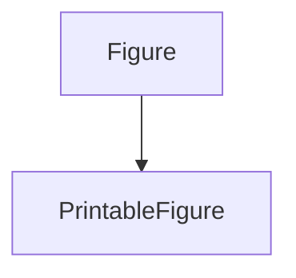
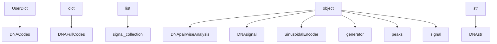

# sig2dna_core Modules Documentation

Generated on: **2025-05-27 21:48:25**

There is no preambule.

## Main Classes

<a href="#sig2dna_core_figprint" style="text-decoration: none; font-weight: bold;">
1. sig2dna_core.figprint
</a>

<a href="#sig2dna_core_signomics" style="text-decoration: none; font-weight: bold;">
2. sig2dna_core.signomics
</a>

<a href="#table_of_contents" title="Back to Table of Contents" style="text-decoration: none;">⬆️ TOC</a>
<a href="#sig2dna_core_signomics" title="Go to Next Module: sig2dna_core.signomics" style="text-decoration: none;">➡️ Next</a>

## Module `sig2dna_core.figprint`

### Class Inheritance Diagram

**Class Examples:** Not available.

### Methods Table

| Class | Method | Docstring First Paragraph | # Lines | __version__ |
|-------|---------|---------------------------|---------|-------------|
| (module-level) | `_generate_figname` | Generate a cleaned filename using figure metadata or the current datetime. | 19 |  |
| (module-level) | `_print_generic` | Generic saving logic for figure files. | 27 |  |
| (module-level) | `custom_plt_figure` | Override `plt.figure()` to return PrintableFigure by default. | 9 |  |
| (module-level) | `custom_plt_subplots` | Override `plt.subplots()` to return PrintableFigure. | 10 |  |
| (module-level) | `is_valid_figure` | Check if `fig` is a valid and open Matplotlib figure. Parameters: fig (object): Any object to check. | 10 |  |
| (module-level) | `print_figure` | Save a figure as PDF, PNG, and SVG. | 25 |  |
| (module-level) | `print_pdf` | Save a figure as a PDF. Example: -------- >>> fig, ax = plt.subplots() >>> ax.plot([0, 1], [0, 1]) >>> print_pdf(fig, "myplot", overwrite=True) | 10 |  |
| (module-level) | `print_png` | Save a figure as a PNG. | 9 |  |
| (module-level) | `print_svg` | Save a figure as an SVG (vector format, dpi-independent). | 9 |  |
| `PrintableFigure` | `print` | Save figure in PDF, PNG, and SVG formats. | 10 |  |
| `PrintableFigure` | `print_pdf` |  | 2 |  |
| `PrintableFigure` | `print_png` |  | 2 |  |
| `PrintableFigure` | `print_svg` |  | 2 |  |
| `PrintableFigure` | `show` | Display figure intelligently based on context (Jupyter/script). | 15 |  |

<a href="#sig2dna_core_figprint" title="Go to Previous Module: sig2dna_core.figprint" style="text-decoration: none;">⬅️ Previous</a>
<a href="#table_of_contents" title="Back to Table of Contents" style="text-decoration: none;">⬆️ TOC</a>

## Module `sig2dna_core.signomics`

### Class Inheritance Diagram

**[Class Examples for `sig2dna_core/signomics.py` (19)](class_examples.html#sig2dna_core_signomics)**

### Methods Table

| Class | Method | Docstring First Paragraph | # Lines | __version__ |
|-------|---------|---------------------------|---------|-------------|
| (module-level) | `import_local_module` | Import a module by name from a file path relative to the calling module. | 37 | 0.41 |
| `DNACodes` | `__init__` | Initialize self.  See help(type(self)) for accurate signature. | 4 | 0.41 |
| `DNACodes` | `sindecode` | Decode sinusoidally embedded codes grouped by letter into symbolic segment structure. | 24 | 0.41 |
| `DNACodes` | `sinencode` | Encode symbolic segments at each scale using sinusoidal encoding grouped by letter. | 22 | 0.41 |
| `DNACodes` | `summary` | Print the number of encoded vectors or symbolic segments per scale. | 12 | 0.41 |
| `DNAFullCodes` | `__init__` | Initialize self.  See help(type(self)) for accurate signature. | 4 | 0.41 |
| `DNAFullCodes` | `__repr__` | Return repr(self). | 2 | 0.41 |
| `DNAFullCodes` | `__str__` | Return str(self). | 2 | 0.41 |
| `DNAFullCodes` | `sindecode` | Sindecode method | 11 | 0.41 |
| `DNAFullCodes` | `sinencode` | Sinencode method | 10 | 0.41 |
| `DNAFullCodes` | `summary` | Return a brief summary of the full codes per scale. | 10 | 0.41 |
| `DNApairwiseAnalysis` | `__init__` | Initialize self.  See help(type(self)) for accurate signature. | 10 | 0.41 |
| `DNApairwiseAnalysis` | `__repr__` | Return repr(self). | 7 | 0.41 |
| `DNApairwiseAnalysis` | `__str__` | Return str(self). | 2 | 0.41 |
| `DNApairwiseAnalysis` | `best_dimension` | Determine optimal dimension by maximizing silhouette score. | 16 | 0.41 |
| `DNApairwiseAnalysis` | `cluster` | Assign cluster labels from linkage matrix. | 5 | 0.41 |
| `DNApairwiseAnalysis` | `compute_linkage` | Compute hierarchical clustering. | 6 | 0.41 |
| `DNApairwiseAnalysis` | `dimension_variance_curve` | Computes the cumulative explained variance (based on pairwise distances) as a function of the number of dimensions used (from 1 to n-1). Optionally plots the curve and the point where the threshold (default 0.5) is reached. | 46 | 0.41 |
| `DNApairwiseAnalysis` | `get_cluster_labels` | Returns cluster labels from hierarchical clustering. If not computed yet, computes linkage. | 20 | 0.41 |
| `DNApairwiseAnalysis` | `heatmap` | Plot heatmap of pairwise distances. | 9 | 0.41 |
| `DNApairwiseAnalysis` | `load` | Load analysis from file. | 5 | 0.41 |
| `DNApairwiseAnalysis` | `pcoa` | Perform Principal Coordinate Analysis (PCoA). | 7 | 0.41 |
| `DNApairwiseAnalysis` | `plot_dendrogram` | Plot dendrogram from linkage matrix. | 14 | 0.41 |
| `DNApairwiseAnalysis` | `reduced_distances` | Recompute distances on selected subspace. | 4 | 0.41 |
| `DNApairwiseAnalysis` | `save` | Save current analysis to file. | 4 | 0.41 |
| `DNApairwiseAnalysis` | `scatter` | 2D scatter plot in selected dimensions with optional cluster-based coloring. | 40 | 0.41 |
| `DNApairwiseAnalysis` | `scatter3d` | 3D scatter plot in selected dimensions with optional cluster-based coloring. | 38 | 0.41 |
| `DNApairwiseAnalysis` | `select_dimensions` | Update active dimensions. | 8 | 0.41 |
| `DNAsignal` | `__init__` | Initialize DNAsignal with a signal object or 1D array. | 58 | 0.41 |
| `DNAsignal` | `__repr__` | Return repr(self). | 6 | 0.41 |
| `DNAsignal` | `__str__` | Return str(self). | 2 | 0.41 |
| `DNAsignal` | `_get_letter` | Determine letter based on monotonicity and signal range. | 31 | 0.41 |
| `DNAsignal` | `_get_triangle_from_letter` | returns the triangle (counter-clockwise, x are incr) | 27 | 0.41 |
| `DNAsignal` | `_pairwiseEntropyDistance` | Calculate excess-entropy pairwise distances. | 52 | 0.41 |
| `DNAsignal` | `_pairwiseJaccardMotifDistance` | Compute pairwise Jaccard distances based on motif presence across symbolic DNAstr sequences. | 102 | 0.41 |
| `DNAsignal` | `_pairwiseJensenShannonDistance` | Calculate pairwise Jensen-Shannon distances between DNAstr codes at a given scale. | 45 | 0.41 |
| `DNAsignal` | `_pairwiseLevenshteinDistance` | Compute pairwise Levenshtein distances between codes at a given scale. | 61 | 0.41 |
| `DNAsignal` | `align_with` | Align symbolic sequences and compute mutual entropy. | 27 | 0.41 |
| `DNAsignal` | `apply_baseline_filter` | Apply baseline filtering using moving median and local Poisson-based thresholding. | 58 | 0.41 |
| `DNAsignal` | `compute_cwt` | Compute Continuous Wavelet Transform (CWT) using the Mexican Hat wavelet. | 44 | 0.41 |
| `DNAsignal` | `encode_dna` | Encode each transformed signal into a symbolic DNA-like sequence of monotonic segments. | 66 | 0.41 |
| `DNAsignal` | `encode_dna_full` | Convert symbolic codes into DNA-like strings by repeating letters proportionally to their span. | 77 | 0.41 |
| `DNAsignal` | `entropy_from_string` | return the entropy of a string | 5 | 0.41 |
| `DNAsignal` | `find_sequence` | Find occurrences of a specific letter pattern in encoded sequence. | 9 | 0.41 |
| `DNAsignal` | `get_code` | Retrieve encoded data for a specific scale. | 3 | 0.41 |
| `DNAsignal` | `get_entropy` | Calculate Shannon entropy for encoded signal. | 5 | 0.41 |
| `DNAsignal` | `has` | Check if a DNA encoding exists for the specified scale. | 22 | 0.41 |
| `DNAsignal` | `plot_codes` | Plot the symbolic DNA-like encoding as colored triangle segments. | 77 | 0.41 |
| `DNAsignal` | `plot_signals` | Plot signals. | 13 | 0.41 |
| `DNAsignal` | `plot_transforms` | Plot the stored CWT-transformed signals as a signal collection. | 13 | 0.41 |
| `DNAsignal` | `print_alignment` | print aligned sequences | 11 | 0.41 |
| `DNAsignal` | `reconstruct_aligned_string` | Fast reconstruction of aligned signals | 9 | 0.41 |
| `DNAsignal` | `reconstruct_signal` | Reconstruct the signal from symbolic features (e.g., YAZB). | 31 | 0.41 |
| `DNAsignal` | `sindecode_dna` | Decode sinusoidal grouped embeddings into a DNACodes structure. | 29 | 0.41 |
| `DNAsignal` | `sinencode_dna` | Encode `self.codes` into sinusoidal embeddings (grouped by letter). | 13 | 0.41 |
| `DNAsignal` | `sinencode_dna_full` | 🌀 Encode full-resolution DNA-like strings into sinusoidal embeddings grouped by letter. | 29 | 0.41 |
| `DNAsignal` | `synthetic_signal` | Generate flexible synthetic signals. (obsolete) | 9 | 0.41 |
| `DNAsignal` | `tosignal` | Reconstruct an approximate signal from symbolic encodings. | 46 | 0.41 |
| `DNAstr` | `__add__` | Concatenate two DNAstr instances with identical dx values. | 27 | 0.41 |
| `DNAstr` | `__eq__` | Check equality based on symbolic content and dx resolution. | 15 | 0.41 |
| `DNAstr` | `__hash__` | Return hash combining the string content and dx. | 10 | 0.41 |
| `DNAstr` | `__new__` | Construct a new DNAstr object. | 42 | 0.41 |
| `DNAstr` | `__repr__` | Return a short technical representation of the DNAstr instance. | 15 | 0.41 |
| `DNAstr` | `__str__` | String representation. | 11 | 0.41 |
| `DNAstr` | `__sub__` | Subtract two DNAstr sequences by aligning and removing matched regions. | 20 | 0.41 |
| `DNAstr` | `_supports_color` | Returns True if ther terminal supports colors | 4 | 0.41 |
| `DNAstr` | `align` | Align this DNAstr sequence to another, allowing insertions/deletions to maximize matches. | 158 | 0.41 |
| `DNAstr` | `excess_entropy` | Compute the excess Shannon entropy of two DNAstr sequences H(A)+H(B)-2*H(AB) | 3 | 0.41 |
| `DNAstr` | `extract_motifs` | Extract and analyze YAZB motifs (canonical and distorted) from the symbolic sequence. | 68 | 0.41 |
| `DNAstr` | `find` | Finds all fuzzy (or regex-based) occurrences of a DNA-like sequence pattern. | 42 | 0.41 |
| `DNAstr` | `html_alignment` | Render the alignment using HTML with color coding: - green: match - blue: gap - red: substitution | 24 | 0.41 |
| `DNAstr` | `jaccard` | Compute the Jaccard distance between two DNAstr sequences. | 19 | 0.41 |
| `DNAstr` | `jensen_shannon` | Compute the Jensen-Shannon distance between self and another DNAstr. | 24 | 0.41 |
| `DNAstr` | `levenshtein` | Compute the Levenshtein distance between this DNAstr and another one. | 38 | 0.41 |
| `DNAstr` | `mutual_entropy` | Compute the Shannon mutual entropy of two DNAstr sequences from their aligned segments | 12 | 0.41 |
| `DNAstr` | `plot_alignment` | Plot a block alignment view of two DNAstr sequences with color-coded segments. | 62 | 0.41 |
| `DNAstr` | `plot_mask` | Plot a color-coded mask of the alignment between sequences. | 20 | 0.41 |
| `DNAstr` | `score` | Return an alignment score, optionally normalized. | 17 | 0.41 |
| `DNAstr` | `summary` | Summarize the DNAstr with key stats: length, unique letters, entropy, etc. | 19 | 0.41 |
| `DNAstr` | `to_signal` | Converts the symbolic DNA sequence into a synthetic NumPy array mimicking the original wavelet-transformed signal. | 54 | 0.41 |
| `DNAstr` | `vectorized` | Map the DNAstr content to an integer array using a codebook. | 21 | 0.41 |
| `DNAstr` | `wrapped_alignment` | Return a line-wrapped alignment view (multi-line), optionally color-coded for terminal/IPython usage (Spyder, Jupyter). | 48 | 0.41 |
| `SinusoidalEncoder` | `__init__` | SinuosidalEncoder Constructor | 22 | 0.41 |
| `SinusoidalEncoder` | `_decode_lsq` | Least-squares phase unwrapping decoder (robust fast decoder). | 29 | 0.41 |
| `SinusoidalEncoder` | `_decode_naive` | Simple decoder based on mean projection (coarse and periodic). | 19 | 0.41 |
| `SinusoidalEncoder` | `_decode_optimize` | Decode each embedding vector via scalar minimization. | 35 | 0.41 |
| `SinusoidalEncoder` | `_decode_svd` | SVD-based phase unwrapping decoder with regularized least-squares. | 33 | 0.41 |
| `SinusoidalEncoder` | `_inverse_sin_embed` | Inverse sinusoidal encoding (approximate). | 23 | 0.41 |
| `SinusoidalEncoder` | `_parse` | Parse values | 10 | 0.41 |
| `SinusoidalEncoder` | `_reconstruct_type` | Reconstruct types | 12 | 0.41 |
| `SinusoidalEncoder` | `_sin_embed` | Project scalar values into sinusoidal embedding space. | 20 | 0.41 |
| `SinusoidalEncoder` | `angle_difference` | Compute angular differences (∆θ) between consecutive embeddings. | 17 | 0.41 |
| `SinusoidalEncoder` | `complex_distance` | Compute distance between two encoded arrays using complex projection. | 28 | 0.41 |
| `SinusoidalEncoder` | `decode` | Decode sinusoidal embeddings back to original values using selected method. | 42 | 0.41 |
| `SinusoidalEncoder` | `encode` | Encode input values into sinusoidal embeddings. | 31 | 0.41 |
| `SinusoidalEncoder` | `fit_encoder` | Fit a scaling factor to normalize values into a target sinusoidal-safe range. | 24 | 0.41 |
| `SinusoidalEncoder` | `group_centroid` | Compute the centroid (average embedding) of each group in complex sinusoidal space. | 43 | 0.41 |
| `SinusoidalEncoder` | `pairwise_similarity` | Compute a pairwise similarity (or distance) matrix in sinusoidal embedding space. | 27 | 0.41 |
| `SinusoidalEncoder` | `phase_alignment` | Align embedding `emb` to reference `ref` using complex phase. | 23 | 0.41 |
| `SinusoidalEncoder` | `phase_unwrap` | Perform Fourier-like phase unwrapping on sinusoidal embedding. | 24 | 0.41 |
| `SinusoidalEncoder` | `set_decode_tolerance` | Set maximum acceptable residual error for decoding. | 10 | 0.41 |
| `SinusoidalEncoder` | `sindecode_dna_grouped` | Decode sinusoidal embeddings grouped by letter into symbolic segments. | 41 | 0.41 |
| `SinusoidalEncoder` | `sinencode_dna_grouped` | Encode symbolic code segments grouped by letter into sinusoidal embeddings. | 36 | 0.41 |
| `SinusoidalEncoder` | `to_complex` | Convert sinusoidal embedding into a complex array using Euler's identity. | 18 | 0.41 |
| `SinusoidalEncoder` | `verify_roundtrip` | Perform an encode → decode → compare roundtrip and report accuracy. | 56 | 0.41 |
| `generator` | `__call__` | Call self as a function. | 12 | 0.41 |
| `generator` | `__init__` | define a peak generator gauss/lorentz/triangle | 3 | 0.41 |
| `generator` | `__repr__` | Return repr(self). | 2 | 0.41 |
| `peaks` | `__add__` |  | 8 | 0.41 |
| `peaks` | `__delitem__` |  | 14 | 0.41 |
| `peaks` | `__getitem__` |  | 11 | 0.41 |
| `peaks` | `__init__` | Initialize a peak collection. | 51 | 0.41 |
| `peaks` | `__len__` |  | 2 | 0.41 |
| `peaks` | `__mul__` |  | 14 | 0.41 |
| `peaks` | `__repr__` | Return repr(self). | 20 | 0.41 |
| `peaks` | `__str__` | Return str(self). | 6 | 0.41 |
| `peaks` | `__truediv__` |  | 3 | 0.41 |
| `peaks` | `add` | Add one or multiple peaks to the collection. | 40 | 0.41 |
| `peaks` | `as_dict` | Return the list of peaks as dict | 3 | 0.41 |
| `peaks` | `copy` | Return a deep-copy of the peaks | 5 | 0.41 |
| `peaks` | `names` | Return the list of names | 3 | 0.41 |
| `peaks` | `remove_duplicates` |  | 10 | 0.41 |
| `peaks` | `rename` |  | 5 | 0.41 |
| `peaks` | `sort` | Sort peaks in-place based on their center positions (x values). | 17 | 0.41 |
| `peaks` | `to_signal` | Generate a signal from a peaks object. Optionally restrict to a subset. | 8 | 0.41 |
| `peaks` | `update` | Update or insert peaks from a list of dictionaries. | 33 | 0.41 |
| `signal` | `__add__` |  | 1 | 0.41 |
| `signal` | `__iadd__` |  | 1 | 0.41 |
| `signal` | `__imul__` |  | 1 | 0.41 |
| `signal` | `__init__` | Initialize a signal instance. | 76 | 0.41 |
| `signal` | `__isub__` |  | 1 | 0.41 |
| `signal` | `__itruediv__` |  | 1 | 0.41 |
| `signal` | `__mul__` |  | 1 | 0.41 |
| `signal` | `__repr__` | Return repr(self). | 21 | 0.41 |
| `signal` | `__str__` | Return str(self). | 5 | 0.41 |
| `signal` | `__sub__` |  | 1 | 0.41 |
| `signal` | `__truediv__` |  | 1 | 0.41 |
| `signal` | `_binary_op` | Binary operation on signals | 10 | 0.41 |
| `signal` | `_copystatic` | Static copy of a signal (x and y only) | 4 | 0.41 |
| `signal` | `_current_stamp` |  | 6 | 0.41 |
| `signal` | `_events` | Register a traceable action in the signal's history. | 23 | 0.41 |
| `signal` | `_from_serializable` | Convert a serialized dict to a signal | 24 | 0.41 |
| `signal` | `_toDNA` | Return a DNA encoded signal | 9 | 0.41 |
| `signal` | `_to_serializable` | Convert the signal into a dictionary suitable for JSON export. | 19 | 0.41 |
| `signal` | `add_noise` | Return a new signal with noise and/or bias added. | 33 | 0.41 |
| `signal` | `align_with` | Align two signals to a common x grid with interpolation and padding. | 35 | 0.41 |
| `signal` | `apply_poisson_baseline_filter` | Apply a baseline filter assuming Poisson-dominated statistics with adjustable gain and a rejection threshold based on the Bienaymé-Tchebychev inequality. | 69 | 0.41 |
| `signal` | `backup` | Backup current state in _previous | 8 | 0.41 |
| `signal` | `copy` | Deep copy of the signal, excluding full history control flag | 24 | 0.41 |
| `signal` | `disable_fullhistory` | Disable full history tracking | 5 | 0.41 |
| `signal` | `enable_fullhistory` | Enable full history tracking | 4 | 0.41 |
| `signal` | `load` | Load a signal from a JSON or gzipped JSON file, including recursive _previous. | 23 | 0.41 |
| `signal` | `plot` | Plot the signal using matplotlib, applying either internal style settings or overrides provided at call time. | 72 | 0.41 |
| `signal` | `restore` | Restore the previous signal version if available | 11 | 0.41 |
| `signal` | `sample` | Interpolate values from x | 3 | 0.41 |
| `signal` | `save` | Save signal to JSON (optionally compressed) and optionally CSV. | 36 | 0.41 |
| `signal_collection` | `__delitem__` | Delete self[key]. | 7 | 0.41 |
| `signal_collection` | `__getitem__` | sc["my_signal"]                  # returns a copy of the signal named "my_signal" sc["A", "B", "C"]                # returns a sub-collection with those names sc[0:2] or sc[[0, 2]]            # still works for index-based access | 19 | 0.41 |
| `signal_collection` | `__init__` | Initialize collection with aligned signals of the same type. | 30 | 0.41 |
| `signal_collection` | `__repr__` | Return repr(self). | 4 | 0.41 |
| `signal_collection` | `__setitem__` | Set self[key] to value. | 5 | 0.41 |
| `signal_collection` | `__str__` | Return str(self). | 2 | 0.41 |
| `signal_collection` | `_align_all` |  | 11 | 0.41 |
| `signal_collection` | `_toDNA` | Return a DNA encoded signal | 9 | 0.41 |
| `signal_collection` | `append` | Append and align the new signal to the existing collection. | 5 | 0.41 |
| `signal_collection` | `mean` | Mean of selected signals, optionally weighted. | 23 | 0.41 |
| `signal_collection` | `plot` | Plot selected signals with style attributes and optional overlays. | 75 | 0.41 |
| `signal_collection` | `sum` | Sum selected signals, optionally weighted by coeffs. | 41 | 0.41 |
| `signal_collection` | `to_matrix` | Return a 2D array (n_signals x n_points) of aligned signal values. | 3 | 0.41 |

