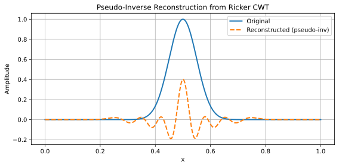
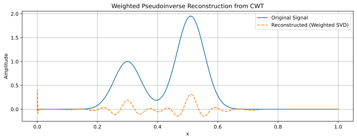

# 🔄 Pseudo-Inverse Reconstruction of Signals Using Ricker Wavelets


## 📑 Synopsis

* The Ricker wavelet offers good **peak sensitivity** and **scale localization**, ideal for chromatographic or spectroscopic signals.
* Use `pywt` instead of deprecated `scipy.signal.ricker`.
* **Never add raw transforms across scales** — it **inflates energy**.
* Use **`DNAsignal.pseudoinverse(scales)`** to apply the correct reconstruction.

> 📌 This document explains how to reconstruct a 1D signal using a **pseudo-inverse method** based on **Ricker wavelet transforms** across multiple scales. This technique is implemented in `DNAsignal.pseudoinverse(scales, method=...)` and relies on **SVD-based or energy-weighted inverse projections**.


---

## 🌊 Wavelet Transform Fundamentals

Let $f(x)$ be a real-valued signal and $\psi(x)$ a real, symmetric wavelet. The **scaled and translated** wavelet is defined as:

$$
\psi_{a,x_0}(x) = \frac{1}{\sqrt{a}} \psi\left(\frac{x - x_0}{a}\right)
$$

The **Continuous Wavelet Transform (CWT)** of $f$ with respect to $\psi$ is:

$$
\mathcal{W}_f(a, x_0) = \int_{-\infty}^\infty f(t)\, \psi_{a,x_0}(t)\, dt
$$

This transform provides a **multiscale analysis** of $f$, revealing localized features such as peaks and singularities.

---

## 🌀 The Ricker Wavelet: Properties and Pitfalls

The **Ricker wavelet**, also known as the **Mexican Hat**, is defined as the second derivative of a Gaussian:

$$
\psi(x) = \left(1 - x^2\right) e^{-x^2 / 2}
$$

It is:

* **Real**
* **Symmetric**
* **Energy-normalized** (its $L^2$ norm does not depend on scale $a$)

> ✅ The Ricker wavelet is **not orthogonal**, and its transforms at different scales are **not independent**. Therefore, naive summation across scales leads to energy inflation and inaccurate reconstruction.

---

## ⚖️ Energy and Redundancy Considerations

Each filtered signal $w_a(x) = f * \psi_a(x)$ (convolution with wavelet at scale $a$) has a comparable $L^2$ norm. Summing these directly:

$$
f_{\text{naive}}(x) = \sum_{a} w_a(x)
$$

leads to an **overestimation of energy**:

$$
\left\|f_{\text{naive}}\right\|^2 = \sum_{a} \| w_a \|^2 \gg \|f\|^2
$$

This is due to **scale redundancy** in the continuous wavelet transform.

---

## 📐 Theoretical Justification: Parseval Property of CWT

In continuous theory, the CWT preserves the $L^2$ norm of the signal (up to a constant):

$$
\int_{0}^{\infty} \int_{-\infty}^{\infty} |\mathcal{W}_f(a, b)|^2 \, \frac{db\, da}{a^2} = C_\psi \cdot \|f\|^2
$$

with admissibility constant:

$$
C_\psi = \int_0^{\infty} \frac{|\hat{\psi}(\omega)|^2}{\omega} \, d\omega < \infty
$$

This implies the **energy of $f$ is spread across scales**, but only under proper scale integration. In discrete settings (as in `DNAsignal`), **scale-wise recombination must be adjusted**.

---

## 🧮 Pseudo-Inverse via SVD (Moore–Penrose)

Given a matrix $W \in \mathbb{R}^{m \times n}$ stacking the CWT of $f$ across $m$ scales:

$$
W = \begin{bmatrix}
w_1 \\
w_2 \\
\vdots \\
w_m
\end{bmatrix}
$$

We perform an SVD:

$$
W = U \Sigma V^T
$$

and reconstruct $f$ via:

$$
f \approx V \Sigma^{-1} U^T W
$$

This removes scale redundancy and yields a stable approximation. **Truncating** singular values (rank $r$) denoises the result:

$$
f_r \approx V_r \Sigma_r^{-1} U_r^T W
$$

---

## ⚖️ Weighted Reconstruction Strategy

Alternatively, we define a **weight $w_i$ for each scale** and compute a weighted inverse:

* Define $W_i = f * \psi_{a_i}$ as the transformed signal at scale $a_i$
* Normalize by energy or apply a regularization

### Weighted matrix:

$$
\tilde{W} = \begin{bmatrix}
w_1 W_1 \\
w_2 W_2 \\
\vdots \\
w_m W_m
\end{bmatrix}
$$

Then apply SVD or least-squares inversion to solve for $f$. 

Solve for inverse with:

$$
\hat{S} = W^\dagger \cdot W
$$


---

## 🧪 Python Example Using `pywt`

This implementation is naïve, but illustrate the principles.

```python
import numpy as np
import pywt
import matplotlib.pyplot as plt
from scipy.linalg import svd

# Create a synthetic Gaussian signal
x = np.linspace(0, 1, 1024)
signal_data = np.exp(-(x - 0.5)**2 / (2 * 0.0025))

# Choose a compatible continuous wavelet
wavelet = pywt.ContinuousWavelet("mexh")  # Mexican Hat = Ricker

# Scales for the transform
scales = [1, 2, 4, 8, 16, 32]
wavelet_matrix = []

for scale in scales:
    cwt_result, _ = pywt.cwt(signal_data, [scale], wavelet)
    wavelet_matrix.append(cwt_result[0])

# Stack transforms into matrix W
W = np.vstack(wavelet_matrix)  # Shape: (n_scales, len(signal))

# SVD-based pseudoinverse
U, s, Vh = svd(W, full_matrices=False)
rank = 6  # Truncate if desired
S_inv = np.diag([1/s[i] if i < rank else 0 for i in range(len(s))])
recon_signal = (U @ S_inv @ U.T @ W).sum(axis=0)

# Plot
plt.figure(figsize=(8, 4))
plt.plot(x, signal_data, label="Original", linewidth=2)
plt.plot(x, recon_signal, '--', label="Reconstructed (pseudo-inv)", linewidth=2)
plt.title("Pseudo-Inverse Reconstruction from Ricker CWT")
plt.xlabel("x"); plt.ylabel("Amplitude"); plt.grid(True); plt.legend()
plt.tight_layout(); plt.show()
```



---


## 🧮 Implemented methods

`DNAsignal.pseudoinverse` offers several methods of inversion.

| Method         | Description                                                  |
| -------------- | ------------------------------------------------------------ |
| `"svd"`        | Pseudo-inverse via SVD, optionally truncated (good for denoising). |
| `"energy"`     | Directly weighted sum using scale energy $|W_i|_2$ (high-energy scales dominate). |
| `"inv_energy"` | Regularized inverse sum, weights $\propto 1/|W_i|_2$ (penalizes noisy/amplified scales). |
| `"custom"`     | User-defined weights, must match the number of selected scales. |


---


## 🌟 Improved inversion | Advanced example

> The scaled Ricker (Mexican hat) wavelet is defined as $\psi(t) = \left(1 - \frac{t^2}{\sigma^2}\right) \exp\left(-\frac{t^2}{2\sigma^2}\right)$. Its energy (squared integral) scales with $\sigma$ as $\|\psi\|^2 \propto \frac{1}{\sigma}$. Therefore, the energy of the wavelet decreases as scale increases. When using multiple scales in a continuous wavelet transform (CWT), this creates **non-uniform energy contributions**, making naive reconstruction by summing contributions unstable.

The reconstruction is improved by using a **weighted pseudo-inverse** approach. Each wavelet-transformed scale is normalized by its wavelet energy (L2 norm), which corrects for the inherent energy amplification across scales due to the redundancy of the CWT.

Here an example with  3 Gaussian peaks—2 of which are partially overlapping.


------

### 🧮 Weighted Pseudoinverse Strategy

Let:

- $W_i$: CWT at scale $s_i$ (1D array)
- $w_i$: weight inversely proportional to the energy of the wavelet at scale $s_i$

Then:

1. Form matrix $W = [w_1 W_1, w_2 W_2, \dots, w_n W_n]^\top$
2. Solve for inverse with:

$\hat{S} = W^\dagger \cdot W$


```python
import numpy as np
import pywt
import matplotlib.pyplot as plt
from scipy.linalg import svd

# Create a synthetic Gaussian signal
x = np.linspace(0, 1, 1024)
signal_data = np.exp(-(x - 0.5)**2 / (2 * 0.0025))

# Choose a compatible continuous wavelet
wavelet = pywt.ContinuousWavelet("mexh")  # Mexican Hat = Ricker

# Scales for the transform
scales = [1, 2, 4, 8, 16, 32]
wavelet_matrix = []

for scale in scales:
    cwt_result, _ = pywt.cwt(signal_data, [scale], wavelet)
    wavelet_matrix.append(cwt_result[0])

# Stack transforms into matrix W
W = np.vstack(wavelet_matrix)  # Shape: (n_scales, len(signal))

# SVD-based pseudoinverse
U, s, Vh = svd(W, full_matrices=False)
rank = 3  # Truncate if desired
S_inv = np.diag([1/s[i] if i < rank else 0 for i in range(len(s))])
recon_signal = (U @ S_inv @ U.T @ W).sum(axis=0)

# Plot
plt.figure(figsize=(8, 4))
plt.plot(x, signal_data, label="Original", linewidth=2)
plt.plot(x, recon_signal, '--', label="Reconstructed (pseudo-inv)", linewidth=2)
plt.title("Pseudo-Inverse Reconstruction from Ricker CWT")
plt.xlabel("x"); plt.ylabel("Amplitude"); plt.grid(True); plt.legend()
plt.tight_layout(); plt.show()


# %% Advanced example
import numpy as np
import matplotlib.pyplot as plt
from scipy import signal
from scipy.linalg import svd, pinv

# Synthetic signal with three Gaussians (including overlapping)
x = np.linspace(0, 1, 1024)
gauss1 = np.exp(-(x - 0.3)**2 / (2 * 0.002))
gauss2 = np.exp(-(x - 0.5)**2 / (2 * 0.002))
gauss3 = np.exp(-(x - 0.52)**2 / (2 * 0.002))  # Overlaps with gauss2
signal_data = gauss1 + gauss2 + gauss3

# Define scales and initialize
scales = [1, 2, 4, 8, 16]
wavelet_matrix = []
energies = []

# Use PyWavelets for energy normalization
import pywt

for scale in scales:
    coef, _ = pywt.cwt(signal_data, [scale], 'mexh')
    wavelet_matrix.append(coef[0])
    
    # Compute the wavelet kernel and its energy
    wavelet_kernel = pywt.ContinuousWavelet('mexh').wavefun(level=10)[0]
    energy = np.sqrt(np.sum(wavelet_kernel**2))  # L2 norm
    energies.append(energy)

# Normalize each transformed scale by its wavelet energy
W = np.vstack([w / e for w, e in zip(wavelet_matrix, energies)])

# Perform SVD and pseudo-inverse reconstruction
U, s, Vh = svd(W, full_matrices=False)
S_inv = np.diag(1 / s)
recon_signal = U.T @ W
recon_signal = U @ S_inv @ recon_signal
recon_signal = recon_signal.sum(axis=0)

# Plot original and reconstructed signal
plt.figure(figsize=(10, 4))
plt.plot(x, signal_data, label="Original Signal")
plt.plot(x, recon_signal, label="Reconstructed (Weighted SVD)", linestyle="--")
plt.xlabel("x")
plt.ylabel("Amplitude")
plt.title("Weighted Pseudoinverse Reconstruction from CWT")
plt.legend()
plt.grid(True)
plt.tight_layout()
plt.show()


```




> Note that the reconstruction remains rough and not optimized (no scaling)