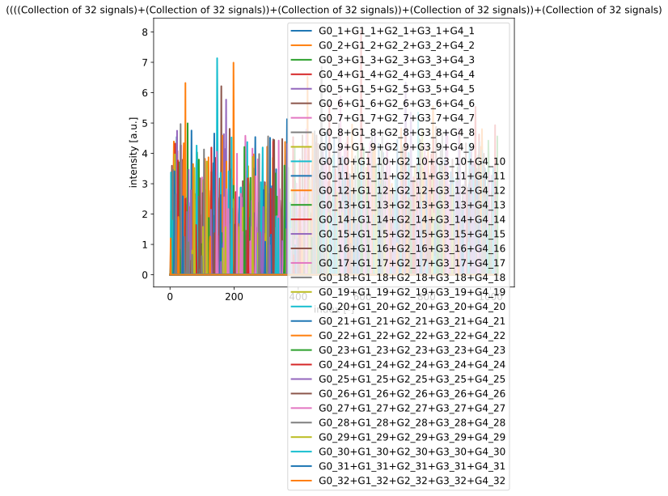
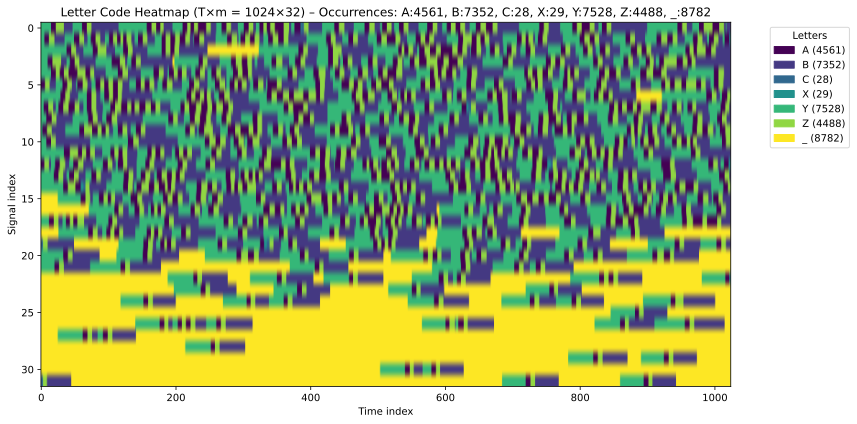
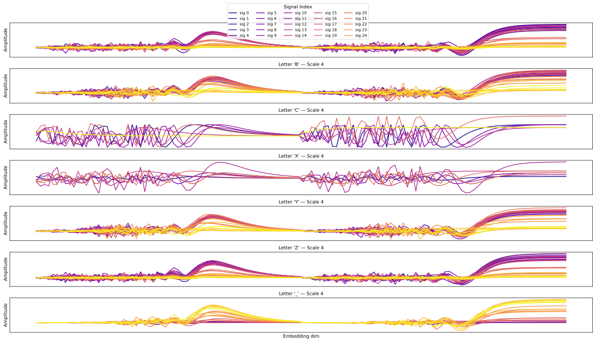
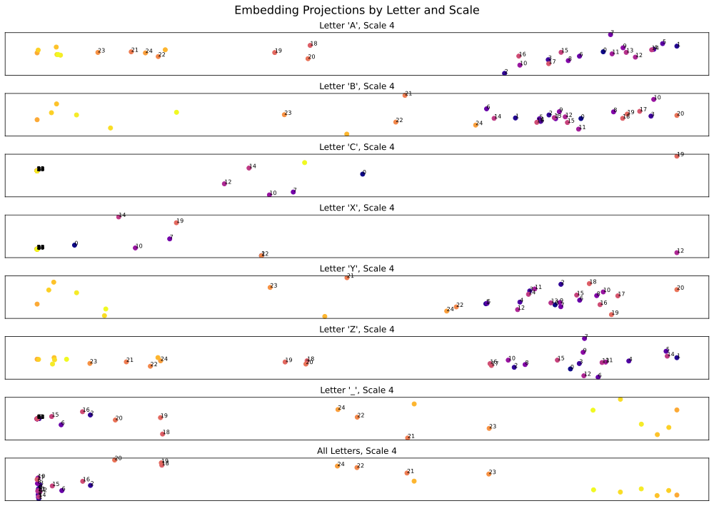
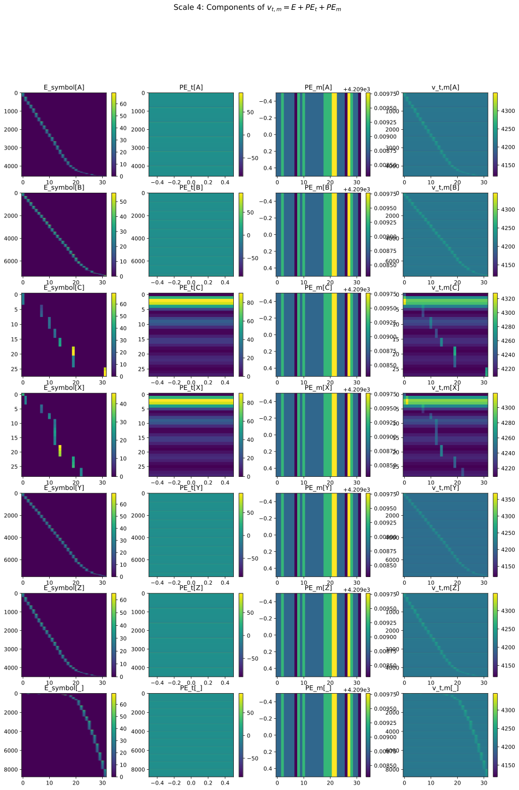
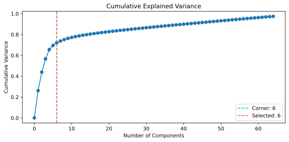
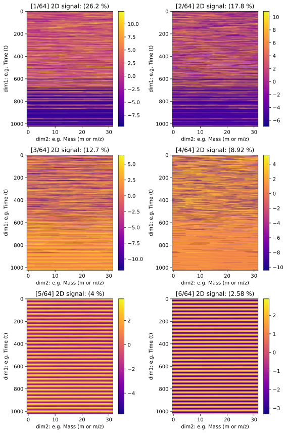
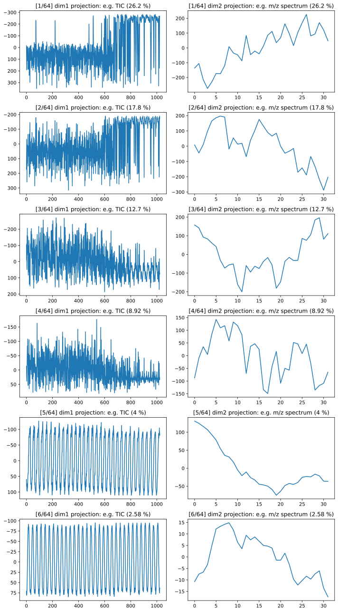
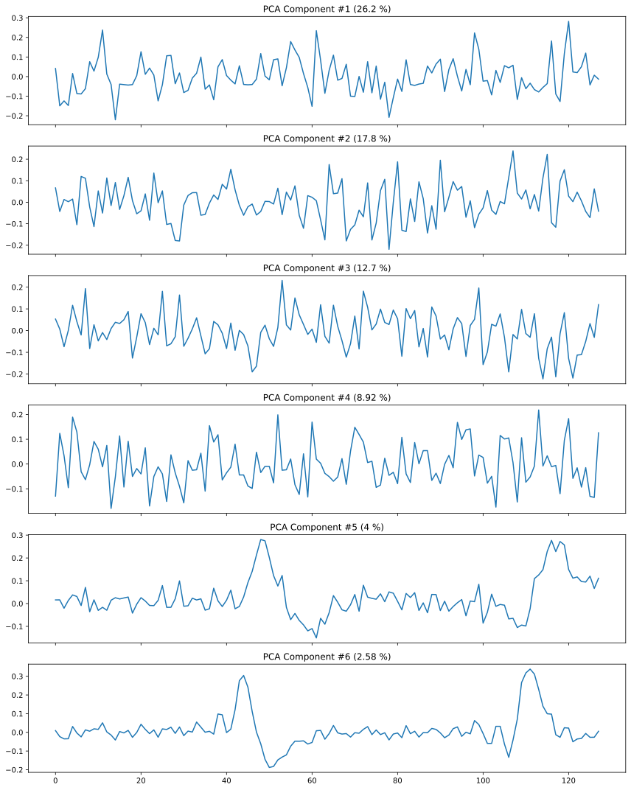

# 📡🧬 Blind Deconvolution of 2D Signals using DNA Representations

This tutorial demonstrates how to transform, encode, and blindly decompose **2D analytical signals** (e.g., GC-MS spectra) into **latent symbolic representations** using sinusoidal encodings and projection techniques. The approach is part of the **Generative Simulation Initiative **🌱, and targets applications such as:


> 📦 **Applications**
>
> - **Polymer fingerprinting** 🫆
> - **Formulation demixing** 🔢
> - **NIAS identification in recycled materials** 🪪
> - **Non-targeted screening** 🔬
> - **Chromatogram simplification and annotation** 📊
> - Separation of **latent signals** in multiplexed detectors 📈
> - General **symbolic representation** of continuous 1D/2D data streams 🔡
>


We illustrate the methodology using the Python-based 📡🧬 `sig2dna` framework.


---

## 1 | 📖 Generalizing from 1D to 2D Symbolic Encodings

In one-dimensional (1D) signals (e.g., 1D chromatograms, spectrograms, etc.), we can identify meaningful structures via local curvature analysis (e.g., inflection points, peaks). This can be symbolically encoded into a discrete alphabet.

But in **2D signals**, such as time × mass GC-MS maps, we face new challenges:

- **Multiple overlapping sources**
- **Lack of predefined time-m/z semantics**
- **Unclear spatial symmetries**

To overcome these, we adopt a **double-layered coding**:

1. **Symbolic Layer**: numeric signal → letter codes ('A', 'B', 'C', 'X', 'Y', 'Z', '_')
2. **Geometric Layer**: letter codes → latent sinusoidal embedding ($d$-dimensional)

The final representation becomes a **tensor** in 2D signal × latent space.

We write:

$$
v_{t, m, d} = E_{t, m, d} + PE_t(t, d) + PE_m(m, d)
$$

Or, under the multiplexed acquisition assumption:

$$
v_{u, d} = E_{u, d} + PE_t(u, d)
$$

where:
- $E$ embedding of the symbolic sequence (*i.e.*, encodes letter identity per segment),
- $PE_t$ is sinusoidal positional encoding in time (or raster position),
- $PE_m$ (optionally) encodes identity along mass/ion channels.

> ⚠️ GC-MS signals are time-multiplexed. m/z channels are not parallel but scanned sequentially through the detector.

---


## 2 | 🧪 Pipeline Demonstration


### 2.1 | 🔬 Synthetic Signal Generation: `gcms`

We simulate 5 source signals, each a sparse collection of Gaussian peaks in a 2D (time × ion channel) matrix. Signals are then mixed by linear addition, simulating the co-elution of compounds.

```python
t = 1024  # Number of time samples (dim1)
m = 32    # Number of ion channels or m/z values (dim2)
n_peaks = (6, 10)
n2Dsignals = 5  # Number of source signals (e.g., hypothetical pure substances)

for i in range(n2Dsignals):
    sig = signal_collection.generate_synthetic(
        n_signals=m,           # Each signal is a row of the (t, m) 2D matrix
        n_peaks=n_peaks,       # Random number of peaks
        kinds=("gauss",),      # Shape of the peaks
        width_range=(0.5, 3),  # Peak widths
        height_range=(1.0, 5.0),  # Peak heights
        x_range=(0, t-1),
        n_points=t,
        normalize=False,
        seed=40 + i * 10,
        name_prefix=f"G{i}"
    )[0]
    gcms = sig if i == 0 else gcms + sig  # Create overlapping signals

```

> 💡 This example mimics **5 pure substances** overlapping in a GC-MS acquisition.





---


### 2.2 | 🧬 Symbolic Encoding into a DNA Alphabet

Each 1D signal (ion channel) is symbolically encoded into a string using 7 discrete letters:

```python
dna_gcms = gcms._toDNA(scales=4)
```


> 💡 A 2D signal is converted into a plain text. An isolated peak corresponds to the sequence <kbd>Y</kbd>+<kbd>A</kbd>+<kbd>Z</kbd>+<kbd>B</kbd>+ , where `+` indicates at least one occurrence. 
> - `Y`, `A`, `Z`, `B`: characterize peak shapes
> - `C`, `X`: represent broader curvature regions
> - `_`: represents silence or gaps



> 🖋 This step compresses local curvature into text — enabling symbolic analysis and reconstruction.

---


### 2.3 | 📡 Sinusoidal Encoding in Latent Space

The symbolic strings are embedded into a high-dimensional space using sinusoidal encoding (akin to transformers’ positional encoding).

```python
dna_gcms.sinencode_dna_full(d_model=128, operation='sum')
```

- Embedding matrix: maps each letter to a basis in ℝᵈ
- Positional encoding: uses cosine/sine frequencies to encode position
- The final tensor has shape (T, m, d) or (T⋅m, d)




> 📌 This step preserves spatial order while lifting symbolic structure into a latent space.





> 🎯 Peak-associated letters (YAZB) form separable clusters — useful for blind deconvolution.

---


### 2.4 | 🗺️ Full vs Raster Encoding Modes

In **full encoding**:

$$
v[t, m, d] = E[t, m, d] + PE_t[t, d] + PE_m[m, d]
$$

>💡The full mode has an important memory footprint as it requires a positional encoding also along `dim2`. 




In **raster scan** (flattened space):
$$
v[u, d] = E[u, d] + PE_t[u, d]
$$

> 💡 Raster encoding is memory-efficient and models the real acquisition order of a GC-MS detector.


---


## 3 | 🧊 Blind Deconvolution in Latent Space

We use **PCA** to project the latent tensor and identify linearly independent components.

```python
components, chroma, variance, figs = dna_gcms.deconvolve_latent_sources()
```

> 🤔💭 Think of it as recovering two overlapping texts printed on the same sheet — we don't understand the language, but we can separate writing styles.


This is a **blind decomposition**: no label or training is used. It is particularly useful for identifying:

- Polymer backbone signals
- Additive/formulation fingerprints
- Contamination profiles


### 3.1 | 📏 Number of sources

We use a **corner detection algorithm** on the cumulative explained variance to identify how many components are meaningful:



> 🧠 After 4–5 components, new ones mainly reconstruct sinusoidal background — not actual structures.

---


### 3.2 | 🔍 🔬 Chromatographic Features per Component

Each PCA component can be projected back into `(t, m)` space — recovering **source signals**.



> 🧬 The first 4 components match individual compounds with sparse, well-separated peaks. The 5th and 6th components exhibit a strong band structure.


---


### 3.3 | 📽️ Projection of Latent Components

Summing over mass or time (to get total ion chromatograms or total mass spectra) shows distinct chemical signals in early components, and periodic noise beyond.

Previous trends are confirmed with projected sources either along `dim1` (TIC signal) or along `dim2` (total mass signal). Since positional encoding uses independent frequencies, each non-significant components is aligned on a specific frequency and exhibits a strong sinusoidal shape.



> 🧩 Higher components capture encoding artifacts — not physical structure.


### 3.4 | 🏋 Loadings: the Basis in ℝᵈ

The loadings (PCA eigenvectors) represent latent directions in the sinusoidal embedding space.



> 🖖 Interpretation of latent directions can help filter artifacts and reconstruct sources.


## 🧾 Notes ▶• ılıılıılıılıılıılı. 0

- **Encoding dimension** ($d$) should be overcomplete: $d \geq n_\text{sources}$
- **Corner detection** in PCA helps estimate signal count
- **Blind projection** works without knowing signal semantics
- **Compression** is extreme: signal → DNA → ℝᵈ → PCA → signal


------

## 🧭 Next Steps ﮩ٨ـﮩﮩ٨ـ

The present tutorial stops at the latent space decomposition of complex signals. However, the full potential of the `sig2dna` framework lies in **reconstruction**, **annotation**, and **semantic projection**. Future steps include:

- **Letter Reconstruction** from identified sources
- **Mass spectrum reconstruction** (dim 2) 
- **Robust Fingerprinting** for authentication, traceability. 
- Semantic clustering with UMAP (or T-SNE)

------


#### 🔤 **Letter Sequence Reconstruction** from Latent Components

After PCA separation, each component corresponds to a latent signal that can be **mapped back to its symbolic representation**. This backward transformation allows:

- Visualization of symbolic segments (`YAZB`) contributing to a source
- Identification of peak-rich zones and sparse regions
- Filtering of latent components by symbolic entropy or curvature density

> 🧠 This symbolic back-projection helps **understand** and **validate** the chemical or physical nature of each latent signal — akin to recovering linguistic structure in unknown scripts.

------


### 💥 **Mass Spectrum Reconstruction (dim 2)**

By integrating along the **retention time** dimension (`dim1`), each latent component yields a **pseudo-mass spectrum**:

- Projected TIC (Total Ion Chromatogram) ⇒ spectral profile
- Useful for identifying **co-eluting compounds** and **additives**
- Can be used for **non-targeted mass fingerprinting**

Combined with external libraries (e.g., NIST, PubChem), this reconstructed mass spectrum can be submitted to match real-world compounds.

> 🧬 Blind mass fingerprinting becomes possible even for overlapping or degraded signals — particularly relevant in **recycled polymer matrices**.

------


### 🧷 **Fingerprinting, Traceability, and Classification**

The symbolic encoding and latent separation provide a robust basis for:

- **Batch traceability** in recycled or multi-layered materials
- **Quality classification** using symbolic entropy or PCA projections
- **Authentication** via distance metrics in symbolic or latent space

Because symbolic encodings compress structure without relying on amplitude or noise sensitivity, they are **resistant to minor distortions**, **instrumental drift**, and **chemical degradation**.

> 🔐 This enables a **new generation of chemical barcodes** or **symbolic fingerprints** suitable for industrial monitoring and forensic chemistry.

------


🌱Generative Simulation | olivier.vitrac@gmail.com | June 2025