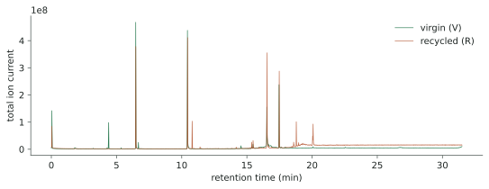
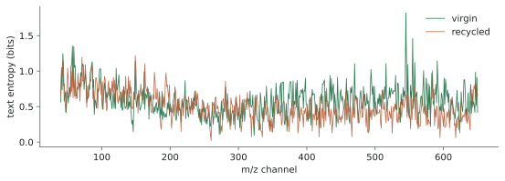
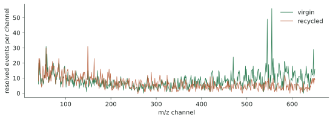
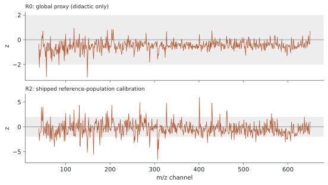
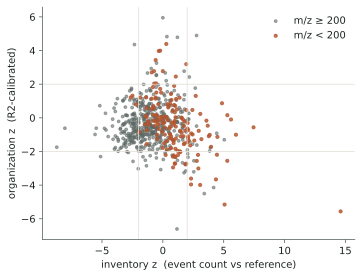
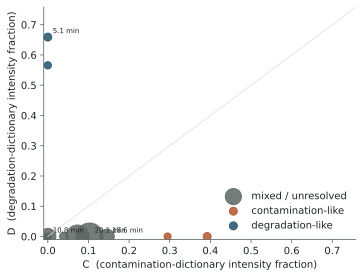
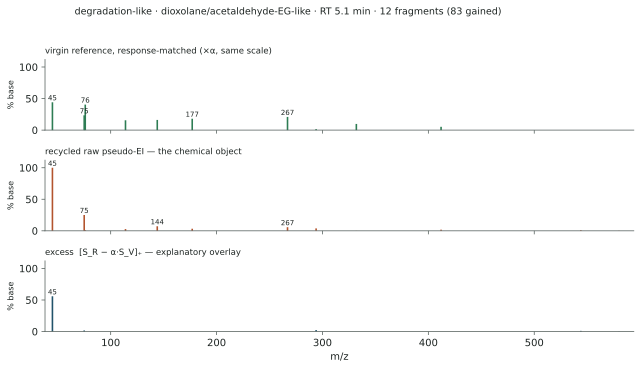
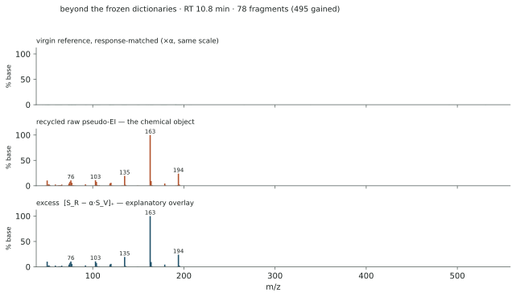
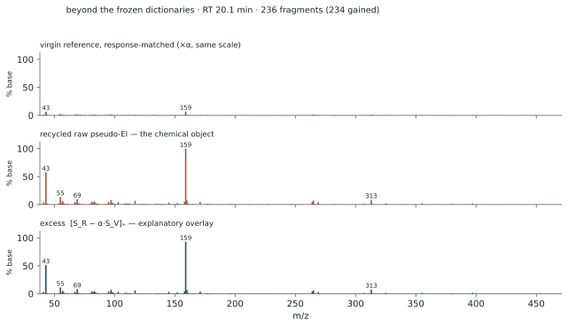
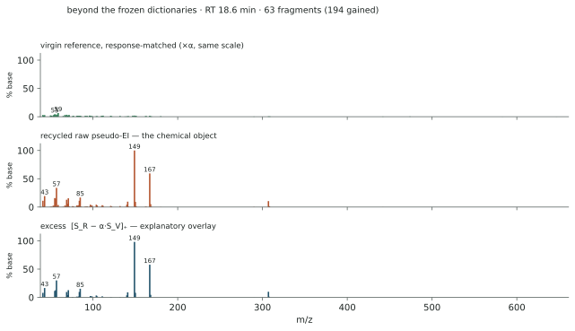

# One virgin and one recycled PET — four readings of the same two signals

*sig2dna case study · GitHub-rendered companion of
[`report.html`](report.html) — same generator
([`run_case_study.py`](run_case_study.py)), same numbers, regenerated
from the shipped anonymized data (611 channels × 13,500 scans,
0.14 s/scan, m/z 40–650). Figures are committed dual-theme SVGs.*

> **Scope of this example.** The two chromatograms are real, anonymized
> measurements (identifiers, timestamps and provenance removed). The
> dataset also ships an anonymized **reference-population calibration**
> (per-channel location and spread of grammar residuals and event
> counts, from 9 anonymized virgin references,
> leave-one-out; mode = `reference_population`). No technical-replicate
> floors exist here. The calibration bundle was built by the same
> software stack that generates this report — per-channel grammar
> calibration is **pipeline-local**; recomputing on a different stack
> may shift individual z values. The numbers illustrate the four
> representations; they are not a validated classification.

## 0 · The two signals

<picture>
<source media="(prefers-color-scheme: dark)" srcset="figures/tic_dark.svg">

</picture>

Summed over all channels the two runs look broadly similar — the
differences that matter live per channel, and each route below reads
them differently.

## 1 · Route 1: CWT letters — shape & organization

Each channel is wavelet-encoded into letters (`Y` rise, `A` apex,
`Z` fall, `B` return, `C`/`X` merged forms, `_` non-coding) after
Poisson rejection of noise segments; amplitude is deliberately
forgotten — the letters read the *morphology*. m/z 545,
most-coded channel of the virgin run:

```text
V  C______ZAZBYA____________________________________ZBYAZA________________________ZAZA_______…
R  ZA____________________ZBYA____________________ZAZA______________ZAZA________ZBYAZA________…
```

| letter counts (all channels) | `Y` | `A` | `Z` | `B` | `C` | `X` | `_` |
|---|---: | ---: | ---: | ---: | ---: | ---: | ---:|
| virgin | 4,363 | 10,641 | 10,513 | 4,235 | 666 | 821 | 324,739 |
| recycled | 1,916 | 8,385 | 8,390 | 1,896 | 719 | 724 | 281,465 |

<picture>
<source media="(prefers-color-scheme: dark)" srcset="figures/entropy_dark.svg">

</picture>

Per-channel text entropy is the intensive organization statistic:
where the recycled trace departs, its channel texts are organized
differently at similar coding density.

## 2 · Route 2: events — inventory & amount

Peaks above each channel's *local* noise threshold become events;
counting them per channel gives the extensive inventory. Population
comparison uses Laplace surprisal: an event class absent from the
reference weighs −log₂(1/(n+2)) bits.

<picture>
<source media="(prefers-color-scheme: dark)" srcset="figures/counts_dark.svg">

</picture>

| | event budget B | ρ_E (median events/channel) |
|---|---:|---:|
| virgin | 5,083 | 7 |
| recycled | 3,971 | 6 |

Composition distance d_comp(V, R) = **0.2846**; directed
information of R against the single-reference V:
E⁺ = **5222 bits** (gained classes),
E⁻ = **6197 bits** (lost classes).
Channels gaining most events: m/z 163 (+18) · m/z 149 (+16) · m/z 150 (+15) · m/z 289 (+12) · m/z 193 (+11) · m/z 157 (+10) · m/z 139 (+10) · m/z 419 (+10) · m/z 324 (+10) · m/z 196 (+10) · m/z 177 (+9) · m/z 115 (+9).

## 3 · Route 3: grammar — organization conditioned on inventory, and why calibration matters

The chain rule I(E, T) = I(E) + I(T | E) in practice: an order-2
Markov grammar trained on the virgin channel texts (gap runs become
punctuation — retention time is punctuation, not vocabulary) assigns
each channel text a code length in bits; the expectation given that
channel's *resolved event count* is subtracted (shipped reference fit:
L̂ = 14.9 + 5.87 N); residuals are
standardized and censored at |z| > 2. **How they are standardized
decides what you see** — the same residuals under three calibrations
of increasing evidential quality:

| calibration of z | P(\|z\|>2), m/z<200 | P(\|z\|>2), m/z≥200 | low/high ratio |
|---|---:|---:|---:|
| `R0 global_proxy` | 0.019 | 0.000 | **∞ (no channel above the gate at m/z ≥ 200)** |
| `R1 density_conditioned` | 0.006 | 0.009 | **0.70** |
| `R2 reference_population` | 0.206 | 0.093 | **2.21** |

Under the global proxy (R0) the flagged channels are **exclusively
low-mass** — a **heteroscedasticity artifact**: grammar-residual
variance grows with channel event density, and one global σ
preferentially pushes dense low-mass channels past the gate while
starving the sparse high-mass channels. Density-conditioned σ(N) (R1)
flattens the mass dependence almost completely; the shipped
per-channel reference-population calibration (R2) is the properly
scaled score. *The representation can be simple; the calibration must
not be.*

<picture>
<source media="(prefers-color-scheme: dark)" srcset="figures/grammar_dark.svg">

</picture>

| R2-calibrated | I_O⁺ (bits) | I_O⁻ (bits) | net |
|---|---:|---:|---:|
| virgin (vs shipped reference population) | 4210 | 88 | +4122 |
| recycled | 489 | 1093 | -603 |

Direction of the organization change R vs V: **net regularization (I_O⁻ dominated)**. Profile
distance (level-free) = 1.114. Calibration mode of every
number in this section: `reference_population` — never to be read as
replicate-grade significance.

### Channel states: what kind of difference does each channel carry?

<picture>
<source media="(prefers-color-scheme: dark)" srcset="figures/quad_dark.svg">

</picture>

| fraction of channels | m/z < 200 | m/z ≥ 200 |
|---|---:|---:|
| stable | 0.606 | 0.594 |
| inventory-only | 0.188 | 0.313 |
| organization-only | 0.138 | 0.062 |
| both | 0.069 | 0.031 |

Inventory change and organization change are largely carried by
*different* channels — the two routes localize different aspects of
the same perturbation, which is exactly what the chain-rule
construction intends.

## 4 · From differential events to chemistry — the two faces of recycling

letters → fragment-peak events → co-eluting fragments → pseudo-EI
spectrum → candidate chemistry

The selection is **blind-first**: the event algebra nominates the
event classes *gained* by the recycled run, chain-clusters their
apexes into co-eluting families (\|t_m − t\*\| ≤ τ =
5.0 s), and reconstructs each family's spectrum from the
**raw, local-baseline-corrected ion amplitudes** of *all* co-eluting
events, normalized to base peak = 100 — event surprisal bits are never
used as intensities. Only *after* reconstruction is each spectrum
compared with two frozen candidate-marker dictionaries: **𝒟**
(degradation/history: furanic-like 96/109, anhydride-like 148,
dioxolane/acetaldehyde-EG-like 87/45, cyclic-oligomer-like 572) and
**𝒞** (contamination/cleanliness: fatty-ester-like 74,
alkylbenzene-like 91, terpene/PAH/alkene-like 121/165/55/56/69,
oxygenate-like 59/72/86/88). D and C are the fractions of a spectrum's
*signature* intensity (10 most intense fragments, exact unit-mass
matching — a ±1 tolerance would conflate anhydride 148 with
dialkyl-phthalate 149). Exemplars need a pole (D ≫ C or C ≫ D) *and*
genuine amplitude excess X = ΣS⁺/ΣS_R ≥ 0.25:
**event-class gain ≠ chemical excess** — the route asks **4a** is
there actual chemical excess? then **4b** what chemistry is it
compatible with?

2899 gained event classes cluster into
20 co-eluting families with ≥ 3 fragments; the
12 strongest were reconstructed
(1 degradation-like, 0 contamination-like at the
poles with X ≥ 0.25; the 3 strongest excess families whose
signatures *neither* dictionary spans are shown as their own
category). Response calibration between the two runs:
α = 1.525 (median per-scan TIC ratio).

<picture>
<source media="(prefers-color-scheme: dark)" srcset="figures/fammap_dark.svg">

</picture>

| RT (min) | fragments | gained | base peak m/z | D | C | X | reading |
|---:|---:|---:|---:|---:|---:|---:|---|
| 10.8 | 78 | 495 | 163 | 0.00 | 0.00 | 0.98 | mixed / unresolved |
| 20.1 | 236 | 234 | 159 | 0.00 | 0.10 | 0.84 | mixed / unresolved — alkene-like |
| 18.6 | 63 | 194 | 149 | 0.00 | 0.15 | 0.81 | mixed / unresolved — alkene-like |
| 4.3 | 12 | 177 | 42 | 0.00 | 0.39 | 0.01 | contamination-like — alkene-like *(class shift)* |
| 1.0 | 7 | 84 | 83 | 0.00 | 0.00 | 0.21 | mixed / unresolved *(class shift)* |
| 5.1 | 12 | 83 | 45 | 0.66 | 0.00 | 0.40 | degradation-like — dioxolane/acetaldehyde-EG-like |
| 29.5 | 9 | 71 | 96 | 0.57 | 0.00 | 0.07 | degradation-like — furanic-like *(class shift)* |
| 26.0 | 8 | 66 | 55 | 0.00 | 0.29 | 0.00 | contamination-like — alkene-like *(class shift)* |
| 23.6 | 5 | 61 | 80 | 0.00 | 0.00 | 0.00 | mixed / unresolved *(class shift)* |
| 17.4 | 168 | 51 | 551 | 0.00 | 0.07 | 0.01 | mixed / unresolved — oxygenate-like *(class shift)* |
| 28.4 | 6 | 42 | 147 | 0.00 | 0.00 | 0.02 | mixed / unresolved *(class shift)* |
| 18.0 | 16 | 35 | 43 | 0.00 | 0.04 | 0.30 | mixed / unresolved — oxygenate-like |

For each exemplar, three spectra: the **virgin reference** around the
same retention region (response-matched by α, same scale), the
**recycled raw pseudo-EI spectrum** — the chemical object — and the
**excess spectrum** [S_R − α·S_V]₊, the explanatory overlay.

#### Degradation face — dioxolane/acetaldehyde-EG-like (RT 5.1 min, base peak m/z 45)

<picture>
<source media="(prefers-color-scheme: dark)" srcset="figures/spec0_dark.svg">

</picture>

#### Beyond the frozen dictionaries — signature outside both dictionaries (RT 10.8 min, base peak m/z 163)

<picture>
<source media="(prefers-color-scheme: dark)" srcset="figures/spec1_dark.svg">

</picture>

#### Beyond the frozen dictionaries — signature outside both dictionaries (RT 20.1 min, base peak m/z 159)

<picture>
<source media="(prefers-color-scheme: dark)" srcset="figures/spec2_dark.svg">

</picture>

#### Beyond the frozen dictionaries — signature outside both dictionaries (RT 18.6 min, base peak m/z 149)

<picture>
<source media="(prefers-color-scheme: dark)" srcset="figures/spec3_dark.svg">

</picture>

What this particular pair says, read blind: the one clean
degradation-pole exemplar carries the dioxolane/acetaldehyde–
ethylene-glycol signature (base peak m/z 45) — a recycling-*history*
marker; no contamination-pole family survives the excess gate, the contamination-flagged families being apex/class shifts rather than new chemistry. The largest genuine excess lies *beyond* the
frozen dictionaries: a **dimethyl-benzenedicarboxylate-like aromatic
ester** (terephthalate-type expected in PET context; positional isomer
unresolved; 163/194/135/103) — a recycling/*process*-history reading —
`E2 · MSP+RI-library supported candidate`, and a **heavy
dialkyl-phthalate-like plasticizer signature** (149/167 over an alkyl
series) `E2 · MSP+RI-library supported candidate`. Neither is
*confirmed* — see the evidentiality ladder below.

> **Recycling leaves at least two chemically distinct memories.** One
> is polymer/process history, illustrated here by a genuine
> dioxolane/acetaldehyde–EG-type excess. The other is foreign
> contamination chemistry, which the frozen dictionary can detect but
> which is not expressed as a genuine excess in this decontaminated
> example. The largest additional spectral information in this sample
> lies instead in previously unencoded aromatic-ester and
> ester-plasticizer-type families, illustrating why the dictionary
> must remain open to unknown chemistry.

> **Naming caution — the evidentiality ladder.** **E0** fragment-
> pattern candidate · **E1** external spectral-library supported ·
> **E2** spectral + independent-library retention-region supported ·
> **E3** measured retention index and/or authentic-standard
> confirmation. Dictionary labels above are E0; the two promoted
> families are E2 — *supported, not confirmed*: their retention
> evidence is a library retention *region*, not a retention index
> measured for these peaks. A standing warning: a very high unit-mass
> EI match score is *not* molecular identity — structurally unrelated
> molecules can share the same nominal mass and the same nominal
> neutral loss.

## 5 · Four readings, one verdict structure

**Letters** say how the chemistry is *arranged* (shape, history).
**Events** say *what and how much* is there (inventory, in additive
bits). **Grammar** says what remains unusual about the arrangement
*once the inventory is known* — signed: perturbations may add texture
(I_O⁺) or erase it (I_O⁻). **Reconstructed spectra** say whether the
gained chemistry looks like degradation or contamination — the two
faces of recycling. No single scalar decides; a defensible verdict is
structured — history × inventory departure × organization × chemistry
× validity domain — and every claim carries the scope it was measured
in.

---

*Generated deterministically by `run_case_study.py` (sig2dna, MIT).
Data: anonymized full-scan GC-MS, shipped as `case_vr.npz`. No
language model was involved in producing any number in this report.*
